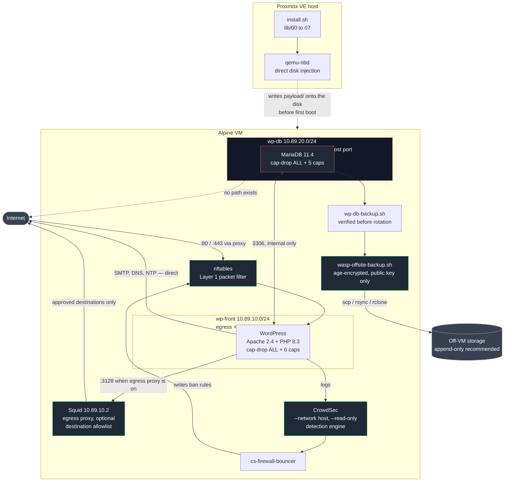
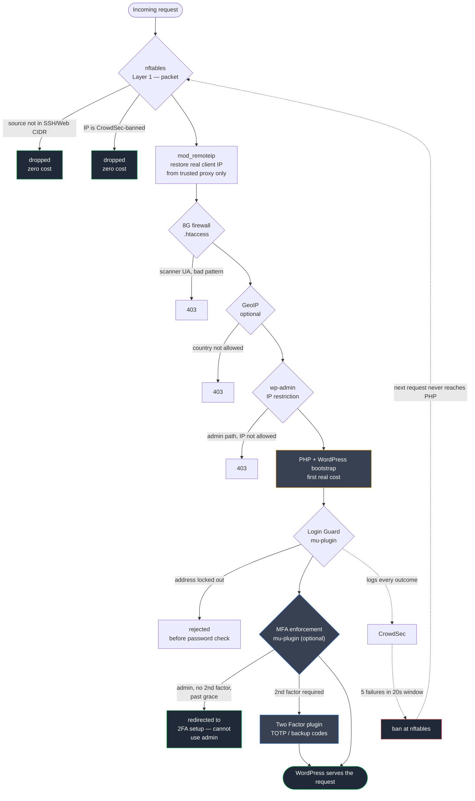
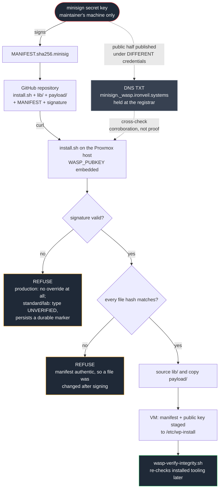
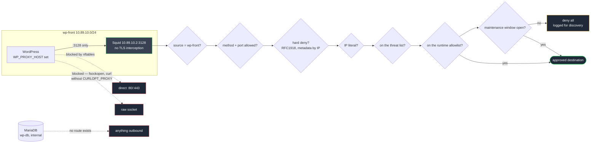
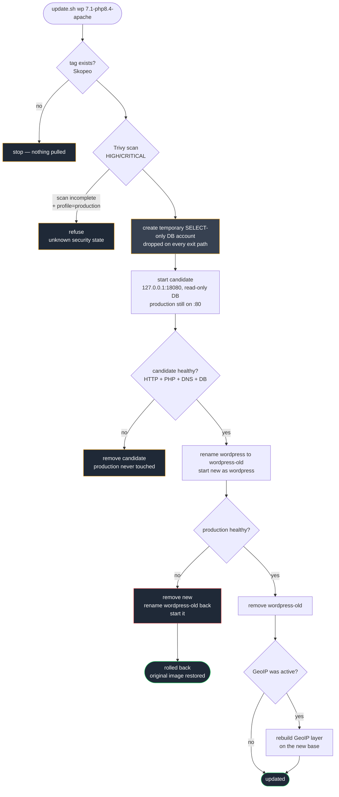
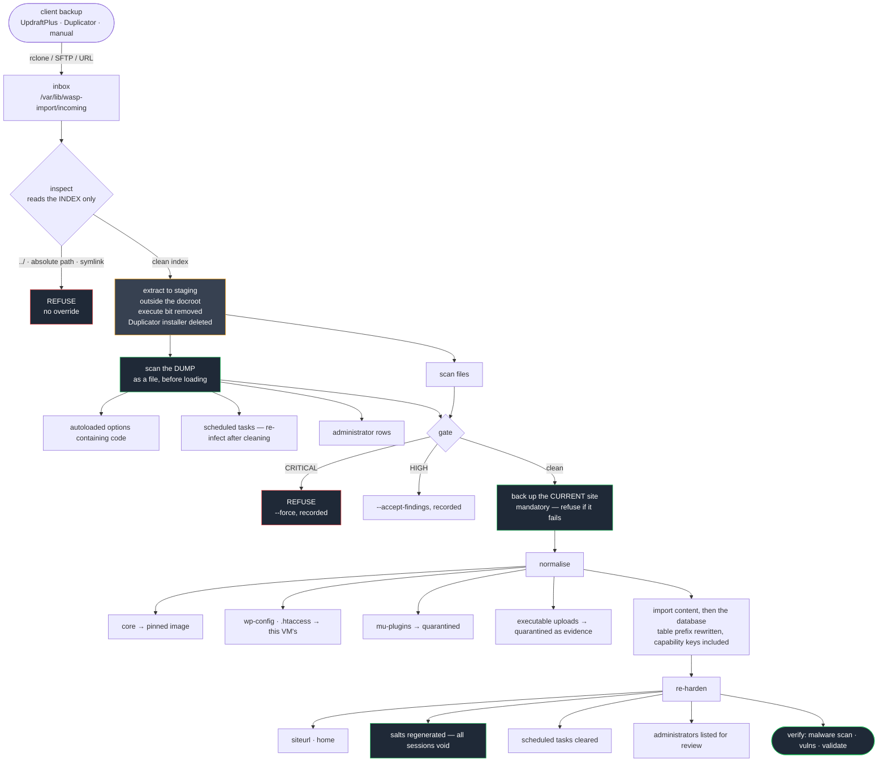

# WASP — Architecture

Diagrams render natively on GitHub. Eight views, because one diagram covering all of this would be unreadable:
what exists, what a request passes through, where trust comes from, what may
leave, how it gets built, how it changes safely, how another site's content gets
in, and what maintains it afterwards. A ninth section walks the login path in
prose, since that one is a sequence of decisions rather than a shape.

---

## 1. Components and trust boundaries

The important structural fact is that **MariaDB has no route to the
internet and no host port**. It sits on a Podman `--internal` network, so a
compromised WordPress cannot reach past it and the database is not exposed
even if a firewall rule is wrong.

---

## 2. What a request passes through

Each layer is cheaper than the one after it. A packet dropped at nftables
costs nothing; a request that reaches PHP has already cost a WordPress
bootstrap and a database query. That ordering is the whole point — it is why
brute-force protection escalates from the application layer down to the
firewall rather than living only in PHP.

---

## 3. Release trust chain

The evaluation that prompted this section put it well: signing was implemented
but not *represented*, so a reader could not see where trust starts or where it
stops. It stops in a specific place, and the diagram says so.

**Where trust actually starts.** A first-time user fetching `install.sh` and
the release from the same repository is trusting that repository — an attacker
who could swap the tarball could swap the embedded key too. Signing does not
change that. What it changes is that the swap becomes **detectable**: the key
would have to change, and the DNS record is held under separate credentials.

**Where it stops.** The DNS cross-check is spoofable without DNSSEC.
`wasp-verify-integrity.sh` runs on the VM, so an attacker with root there can
edit it. Neither is a root of trust; both make tampering evident.

---

## 4. Egress boundary

The ingress side of this system is deliberately public. The egress side is
not. Two independent controls, and the second is the one that makes the first
mean anything.

**Why the order is not cosmetic.** Every deny precedes every allow. A hard
deny placed after the allowlist could be overridden by a wildcard entry —
which is how a cloud metadata endpoint becomes reachable because somebody
allowlisted too broadly. Metadata is denied by **address**, not only by name,
because the property has to survive a request made straight to
`169.254.169.254`, which is exactly what an SSRF payload does.

**Why HTTPS can be filtered without decrypting it.** A client opening an
HTTPS connection through a proxy sends `CONNECT host:443` in plaintext before
the TLS handshake. `dstdomain` matches on that. No SSL Bump, no certificate
authority on the VM, and no ability to read the traffic — only to see where it
is going.

**Why the firewall half is load-bearing.** `WP_PROXY_HOST` is honoured only by
code that chooses to honour it. A plugin calling `fsockopen()`, or `curl`
without `CURLOPT_PROXY`, ignores it entirely. Without the nftables rule the
proxy filters well-behaved traffic only — which is not the traffic anyone is
worried about. `wasp-egress test` proves this by removing WordPress's proxy
configuration and confirming egress *still* fails.

**What it does not do.** This limits *where* traffic goes, not what it
carries. An approved destination that is itself compromised remains reachable.

---

## 5. Install flow

Two phases, split by a reboot: the kernel switch has to happen before
containers exist.

```mermaid
flowchart LR
    subgraph P0["Proxmox host"]
        A["install.sh"] --> B["prompts<br/>lib/01"]
        B --> C["fetch Alpine<br/>verify SHA-512"]
        C --> D["build nftables +<br/>Apache config<br/>lib/03"]
        D --> E["mount disk<br/>qemu-nbd"]
        E --> F["inject payload/<br/>+ vars.sh"]
        F --> G["qm create + start"]
    end

    G --> H

    subgraph P1["VM — stage 1"]
        H["expand rootfs<br/>apk upgrade"] --> I["switch to linux-lts"]
        I --> J(["reboot"])
    end

    J --> K

    subgraph P2["VM — stage 2 : stages 01-10"]
        K["health checks<br/>kernel + Podman"] --> L["digest-pin images<br/>Skopeo"]
        L --> M["networks + secrets"]
        M --> N["Apache hardening<br/>8G, slug, CSP"]
        N --> O["MariaDB then WordPress<br/>then GeoIP"]
        O --> P["OpenRC services"]
        P --> Q["update + mail +<br/>plugin tooling"]
        Q --> R["CrowdSec + backups"]
        R --> S["Trivy, Lynis,<br/>malware scanner"]
        S --> T(["validate: ~45 checks"])
    end

    style J fill:#374151,stroke:#f59e0b,color:#fff
    style T fill:#1f2937,stroke:#22c55e,color:#fff
    style MENU fill:#374151,stroke:#3b82f6,color:#fff
```

---

## 6. Update: candidate, cutover, rollback

Production keeps serving throughout the risky part. The old container is not
destroyed until the new one has proven itself — it *is* the rollback artifact.

---

## 7. Site import

The ordering *is* the security property. Every stage exists to keep untrusted
content away from anything that executes it until it has been examined.

**Nothing is reachable by the web server, or executed by anything, until it
has been scanned.** The natural implementation — extract into the document
root, then scan — leaves a webshell live and serving for as long as the scan
takes, on a site being imported *because* it is suspected compromised.

**The dump is scanned as a file.** Loading it and then querying it is the same
mistake in a different place: by the time you look, the thing you were
checking for has already happened.

**Normalisation discards rather than inspects**, wherever a good replacement
exists. Core comes from the digest-pinned image, so comparing is strictly
worse than replacing. `wp-config.php` carries the source site's credentials
and salts. mu-plugins are active on arrival with no activation step to
withhold. Each is thrown away rather than examined, which removes the entire
question.

**The gate is graded, not binary.** Refusing outright would be useless —
people import compromised sites deliberately, in order to clean them — and
proceeding silently would defeat the tool. So findings are surfaced, overrides
are explicit, and every one is recorded with who made it.

**Re-hardening is not optional.** An import carries the source site's URLs,
users, salts and scheduled tasks. Regenerating salts invalidates every session
the previous operator had, which is the point.

One trap handled explicitly: this VM uses a randomised table prefix, and
rewriting *table names alone* is the classic "changed the prefix and lost
admin access" — `wp_capabilities`, `wp_user_level` and `wp_user_roles` are
stored as meta **values** and carry the prefix too. Miss them and every user
imports with no capabilities, presented as a successful import.

---

## 8. Day-2 tooling

Each tool covers a layer the others do not. The split matters: `update.sh`
and Trivy see the **container image**, while plugins and themes live in a
mounted volume that an image update never touches — which is where roughly
91% of WordPress vulnerabilities are.

```mermaid
graph LR
    T(["VM tooling"])

    T --> MENU["wasp-menu.sh<br/>task-grouped front door<br/>to everything below"]

    T --> U["update.sh"]
    U --> U1["candidate + cutover + rollback"]
    U --> U2["Trivy CVE scan before applying"]
    U --> U3["digest re-pin + version discovery"]
    U --> U4["squid — egress proxy on the<br/>same digest-pinned footing"]

    T --> V["validate-wordpress.sh"]
    V --> V1["~45 checks, each with a fix command"]
    V --> V2["sections: containers, database, web,<br/>security, updates, logs, backups, mail"]

    T --> P["wp-plugins.sh"]
    P --> P1["update visibility"]
    P --> P2["vulnerability scan<br/>Wordfence bulk feed, matched locally"]
    P --> P3["opt-in: Patchstack, WPScan, NVD"]
    P --> P4["install &lt;slug&gt; — WordPress.org<br/>directory only, no URLs/ZIPs"]
    P --> P5["install-file &lt;zip&gt; — local file,<br/>SHA-256 recorded, never a URL,<br/>never staged in the web root"]

    T --> M["wp-malware-scan.sh"]
    M --> M1["PHP in uploads — highest signal"]
    M --> M2["core vs pinned image"]
    M --> M3["YARA rules, tiered"]
    M --> M4["database analysis"]

    T --> H["wp-hardening.sh"]
    H --> H1["feature toggles"]
    H --> H2["egress allow / deny"]
    H --> H3["CrowdSec whitelist"]
    H --> H4["geoip-test"]

    T --> E["wp-mail.sh"]
    E --> E1["status, test, setup, doctor, log"]

    T --> EG["wasp-egress.sh"]
    EG --> EG1["destination allowlist, not just ports"]
    EG --> EG2["test — proves the firewall enforces it"]
    EG --> EG3["discovery — what got blocked, classified by hand"]
    EG --> EG4["maintenance windows that close themselves"]

    T --> IM["wp-import.sh"]
    IM --> IM1["inspect — reads the index, extracts nothing"]
    IM --> IM2["extract — bounded, non-executable staging"]
    IM --> IM3["scan — dump checked BEFORE it is loaded"]
    IM --> IM4["apply — gated, quarantines rather than installs"]

    T --> FO["wp-forensics.sh"]
    FO --> FO1["timeline — when did it appear, what else happened"]
    FO --> FO2["entry-class — uploads / plugin / admin / core"]
    FO --> FO3["since-backup · admins"]

    T --> TR["wasp-testreport.sh"]
    TR --> TR1["one report to read or send on"]

    T --> B["wp-db-backup.sh"]
    B --> B1["verified dump before rotation"]
    B --> B2["pushes off-VM after each verified backup"]

    T --> O["wasp-offsite-backup.sh"]
    O --> O1["scp / rsync / rclone"]
    O --> O2["age public-key encryption<br/>VM cannot decrypt what it sends"]
    O --> O3["remote size confirmed after upload"]
    O --> O4["remote-restore-drill — pulls the<br/>real remote object, decrypts,<br/>restores, records RTO"]

    T --> S["wasp-selftest.sh"]
    S --> S1["restore proof — throwaway DB, real restore"]
    S --> S2["proves the read-only account refuses writes"]

    T --> I["wasp-verify-integrity.sh"]
    I --> I1["installed tooling vs signed manifest"]

    T --> N["wp-notify.sh"]
    N --> N1["host-side msmtp — works when WordPress is down"]
    N --> N2["deduplicated by content, 24h"]
    N --> N3["heartbeat — the only check that detects the VM being GONE"]

    T --> RS["wp-rotate-secrets.sh"]
    RS --> RS1["salts / db / smtp / all"]
    RS --> RS2["verifies before commit, rolls back<br/>refuses the backup key"]

    T --> CAP["wasp-capture.sh"]
    CAP --> CAP1["records a session + diagnostics"]
    CAP --> CAP2["redacts secrets BY VALUE"]
    CAP --> CAP3["one local bundle — uploads nowhere"]

    style T fill:#1f2937,stroke:#22c55e,color:#fff
    style M1 fill:#1f2937,stroke:#22c55e,color:#fff
    style P2 fill:#1f2937,stroke:#22c55e,color:#fff
    style S1 fill:#1f2937,stroke:#22c55e,color:#fff
    style O2 fill:#1f2937,stroke:#22c55e,color:#fff
    style EG2 fill:#1f2937,stroke:#22c55e,color:#fff
    style IM3 fill:#1f2937,stroke:#22c55e,color:#fff
    style N3 fill:#1f2937,stroke:#22c55e,color:#fff
```

## 9. The login path, layer by layer

The login-flow diagram in section 2 shows five gates before WordPress serves an
admin request. They are deliberately ordered cheapest-first, and each rests on a
different assumption failing, so defeating one does not defeat the next:

1. **nftables** drops a banned or out-of-CIDR source for zero cost — no PHP, no
   database. Under a distributed attack this is what keeps the box up.
2. **mod_remoteip** restores the real client IP, but only from the one proxy
   address declared trusted, so every IP-based decision below it is made on a
   value an attacker cannot forge per-request.
3. **The 8G firewall, GeoIP and wp-admin IP restriction** (all in `.htaccess`,
   still before PHP) reject scanners, disallowed countries, and admin access
   from unapproved networks.
4. **The login guard** (`02-wpvm-login-guard.php`) throttles password guessing
   on the `authenticate` filter and removes WordPress's username-enumeration
   leak, and feeds every outcome to CrowdSec for banning at layer 1.
5. **MFA enforcement** (`03-wpvm-mfa-enforce.php`, optional) is the layer that
   assumes the password itself was phished or reused. It requires administrators
   to hold a *configured* second factor and gates every wp-admin request — not
   just the login moment — so a stale session or a survived cookie cannot walk
   past it. It closes the REST and application-password channels for unenrolled
   admins too, so the second factor cannot be bypassed by switching protocols.

The critical design property of layer 5 is that **enforcement is built around
recovery**: a grace window before blocking, backup codes as a valid factor,
email excluded for admins (it is the reset channel), and a console-only reset
for total loss. Enforcement without a recovery path is not a security control,
it is a way to lock yourself out of your own estate. The reset is safe to
document precisely because it needs hypervisor access, which is strictly more
than a WordPress login — see SUPPORT-RUNBOOK.md.

The plugin machinery itself is the WordPress core team's Two Factor plugin,
installed through `wp-plugins.sh` from the WordPress.org directory. The
enforcement lives in a separate mu-plugin so the plugin can update freely and so
the enforcement cannot be switched off from the admin panel an intruder would
reach first.

---

*Diagrams describe the system as built. If one disagrees with the code, the
code is right and the diagram is a bug — please report it.*

— **IronVeil Systems DevOps**
