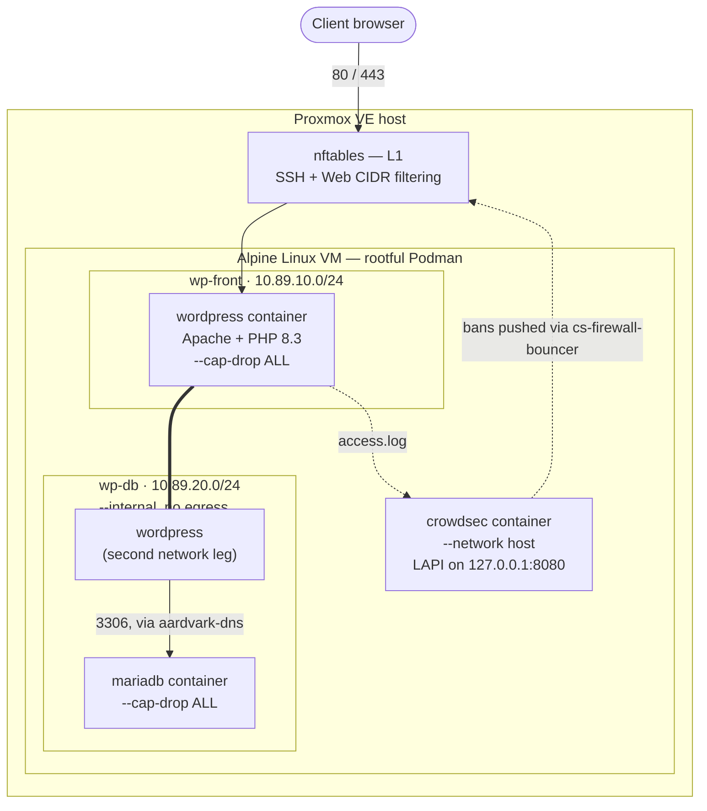

<div align="center">
  

  **Secure · Harden · Protect · Monitor**

  *Hardened WordPress provisioning for Proxmox VE.*
</div>

# WASP — WordPress Alpine Security Platform

A small, git-cloneable repository (`install.sh` plus `lib/` and `payload/`) that turns a bare Proxmox VE host into a fully provisioned, network-segmented WordPress VM — Alpine Linux, rootful Podman, MariaDB, and CrowdSec — with layered firewalling, SHA256 image digest pinning, optional GeoIP filtering, structurally-verified automated backups (see [Known Limitations](#known-limitations) for exactly what "verified" covers), and a full day-2 update/rollback/self-diagnosis toolchain baked in.

> **"~91% of WordPress vulnerabilities live in plugins — where most hardening never looks. This one does."**
> — RothITguy *(figure: Patchstack, State of WordPress Security in 2026)*

No Ansible, no Terraform, no cloud-init dependency, nothing beyond what a Proxmox host already has. Answer around 16 interactive prompts and roughly 15 minutes later — most of it unattended — you have a WordPress site sitting behind its own firewall, intrusion-prevention engine, vulnerability scanner, and nightly database backups that are integrity-checked on creation.

A note on how to read that sentence, and this README generally: "integrity-checked" means each backup's dump completion marker and gzip archive are verified before old backups are rotated — it does **not** mean the backup has been test-restored, or that a copy exists off this VM. Both of those are open items ([Known Limitations](#known-limitations), `TODO.md`). The same care applies elsewhere: the WordPress update "candidate" is isolated at the HTTP and filesystem level but shares the live database; CrowdSec provides firewall-level enforcement of ban decisions, not WAF request inspection; and rootful containers are contained primarily by the VM boundary rather than by the container runtime. Each of those is spelled out where it comes up below.

| | |
|---|---|
| **Host** | Proxmox VE (anything with `qm`, `pvesm`, `pvesh`) |
| **Guest OS** | Alpine Linux — auto-detects the newest available release (3.24 → 3.21), BIOS cloud image |
| **Container runtime** | Podman, **rootful only** |
| **Stack** | WordPress `7.1-php8.4-apache` · MariaDB `11.4` · CrowdSec `v1.7.8` |
| **Default sizing** | 2 vCPU · 4096 MB RAM · 20G disk (edit `CORES`/`RAM`/`DISK` in `lib/00-preflight.sh` to change) |
| **Networking** | Two segmented Podman networks — `wp-front` (egress + published port) and `wp-db` (`--internal`, no egress) |
| **Deployment profile** | `production` — the only one. Verification failures are fatal; Squid, MFA, egress filtering and a resolvable relay are all required |
| **Setup time** | ~15 minutes, mostly unattended after the prompts |
| **CLI flags** | None — `install.sh` itself is fully interactive (the management scripts it installs are not — see [Day-2 Operations](#day-2-operations)) |

---

## Credits

WASP is a provisioner: most of what it installs is other people's work. Every component, feed and service it uses is credited in [NOTICE.md](NOTICE.md), with licences.

One deserves naming here: the **8G Firewall** by **Jeff Starr** ([Perishable Press](https://perishablepress.com/8g-firewall/)) is the only third-party source embedded directly in this repository, because it has to exist before WordPress serves its first request.

## Why I built this

I kept standing up WordPress for people and watching the same three failures, in the same order:

1. **A plugin was four versions behind** and something walked in through it. Nobody was looking at plugins — the host was patched, the container was scanned, and the actual door was wide open.
2. **The "backup" was an empty file.** It had been running nightly for a year. Nobody had ever restored one, and the cron job had been failing silently since the second week.
3. **An update broke the site**, at a bad hour, with no way back except a snapshot somebody hoped existed.

Every one-click installer I tried solved *"get WordPress running."* None of them solved *"still be running, still be yours, in six months."*

So this one is opinionated about the boring things, because the boring things are what actually fail: the database shouldn't be reachable from anywhere, an update should have to prove itself on a throwaway container before it touches production, and a backup nobody has checked is not a backup.

It's also honest about where it stops. Every control here states its own limits at the prompt, not buried in documentation — because a control you over-trust is worse than one whose edges you know. If a setting is noise reduction rather than a boundary, it says so before you rely on it.

— **RothITguy**

---

## Table of Contents

- [Why I built this](#why-i-built-this)
- [Naming and versions](#naming-and-versions)
- [Before you use this](#before-you-use-this)
- [What This Is](#what-this-is)
- [Egress control (Squid)](#egress-control-squid)
- [Checking the whole VM](#checking-the-whole-vm-at-once)
- [Alerts](#alerts)
- [Choosing a DNS resolver](#choosing-a-dns-resolver)
- [The operator menu](#the-operator-menu)
- [File integrity: WordPress checksums](#file-integrity-wordpress-checksums)
- [PHP process-execution functions](#php-process-execution-functions)
- [Commercial themes and plugins](#commercial-themes-and-plugins)
- [Capturing a session for review](#capturing-a-session-for-review)
- [Testing it from the outside](#testing-it-from-the-outside)
- [Rotating credentials](#rotating-credentials)
- [Monitoring from outside](#monitoring-from-outside)
- [If you are locked out](#if-you-are-locked-out)
- [Knowing it is still there](#knowing-it-is-still-there)
- [Threat Intelligence](#threat-intelligence-crowdsec-cti)
- [Incident Playbook](INCIDENT-PLAYBOOK.md), the [support runbook](SUPPORT-RUNBOOK.md)
- [MSP Runbook](MSP-RUNBOOK.md)
- [Import design](docs/IMPORT-DESIGN.md)
- [Fleet management](docs/FLEET.md)
- [Architecture Diagrams](ARCHITECTURE.md)
- [Repository Structure](#repository-structure)
- [Architecture](#architecture)
- [Features](#features)
- [Requirements](#requirements)
- [Quick Start](#quick-start)
  - [Verifying what you run](#verifying-what-you-run)
- [Login Protection](#login-protection)
  - [Two-factor authentication for administrators](#two-factor-authentication-for-administrators)
- [Plugin Vulnerability Scanning](#plugin-vulnerability-scanning)
- [Verifying What You Run](#verifying-what-you-run-minisign)
- [Vulnerability Exceptions](#vulnerability-exceptions)
- [Split-horizon DNS (Technitium)](#split-horizon-dns-technitium--so-lan-clients-get-a-real-ip)
- [Nginx Proxy Manager settings](#nginx-proxy-manager--recommended-configuration)
- [Off-VM Backup](#off-vm-backup)
  - [Creating the encryption key](#creating-the-encryption-key)
- [Self-Test](#self-test-proving-the-guarantees-hold)
- [Malware & Integrity Scanning](#malware--integrity-scanning)
- [Outbound Firewall (optional, host-service layer)](#outbound-firewall-optional-host-service-layer)
- [Outbound Email](#outbound-email)
- [WordPress Site Address](#wordpress-site-address)
- [Interactive Setup Walkthrough](#interactive-setup-walkthrough)
- [What Gets Created](#what-gets-created)
- [Security Model](#security-model)
- [Day-2 Operations](#day-2-operations)
- [GeoIP Country Filtering](#geoip-country-filtering)
- [SHA256 Digest Pinning](#sha256-digest-pinning)
- [Deployment Profiles](#deployment-profiles)
- [Automated Jobs](#automated-jobs)
- [File and Directory Reference](#file-and-directory-reference)
- [FAQ](#faq)
- [Troubleshooting](#troubleshooting)
- [Known Limitations](#known-limitations)
- [Changelog Highlights](#changelog-highlights)
- [Credits](#credits)
- [License](#license)

---

## Naming and versions

The project is **WASP** — WordPress Alpine Security Platform. It was previously
`alpine-vm-wordpress`; GitHub redirects the old repository name indefinitely, so
existing clones keep working, but new installs should use the current URL rather
than rely on a redirect that is a courtesy and not a guarantee.

Two identifiers are in use, deliberately:

| | Example | What it is for |
|---|---|---|
| **Release** | `9.3` | What you quote on a change ticket or tell a client |
| **Build** | `2026.08.13n` | Unique per build; what every log line, blocker and changelog entry references |

A single semantic version would lose the ability to say *which* 9.3 a VM is
running, and this project has already spent a session on exactly that ambiguity
— a log labelled with one version while the fix under discussion was in another.
Both appear in the install banner and in `/etc/wp-install/vars.sh`.

## Before you use this

This runs in production, but it is worth being honest about what that means.

**Who it is built for.** An MSP running a small number of client WordPress sites
on Proxmox, where one person does the installs and knows the stack. That is the
context every design decision was made in: prompts assume you understand the
trade being offered, and the tooling assumes an operator rather than an
automated pipeline.

**Current state.** In use across roughly a dozen client sites. Admin MFA,
egress filtering, checksum verification, core updates and local restore are all
proven on real hardware — including **off-site restore**, demonstrated end to
end on 2026-08-20: an encrypted object pulled from object storage, decrypted
with the recovery key, restored into an isolated database and verified
non-empty, with a measured RTO of 33 seconds. Run the drill yourself on YOUR
deployment before depending on it; the claim here is that the mechanism works,
not that your key and destination do. The `CHANGELOG.md` is deliberately a
post-mortem log rather than a feature list — if you want to know how much of
this was learned the hard way, read it.

**What you are taking on.** This is a security-first provisioner, which means it
says no to things. Under `DEPLOYMENT_PROFILE=production` it disables plugin
installs from wp-admin, blocks PHP shell functions, restricts egress to an
allowlist, and refuses to complete an install whose signature does not verify.
Every one of those has a documented toggle and a stated reason. If you want a
platform that gets out of your way, this is the wrong one.

**Read `TODO.md` before deciding.** It lists what is not done, including things
that will be visible to you — a brief database error on the first reboot, for
one. Nothing there is hidden, and a stale entry claiming a gap that is actually
closed is treated as a defect in its own right.

**No support commitment.** It is MIT-licensed and public because it may be
useful, not because there is a support contract behind it. Issues and patches
are welcome; a response is not guaranteed.

## What This Is

Run `install.sh` on a Proxmox VE host as root. It will:

1. **Ask you a series of prompts** — VM sizing lives in `lib/00-preflight.sh` as variables (not a prompt); networking, SSH access, firewall CIDRs (format-validated, re-prompting on a bad value), a custom `wp-admin` URL, CrowdSec enrolment, GeoIP filtering, image-digest pinning, and a deployment profile are all configured interactively.
2. **Download and verify** the newest Alpine Linux cloud image directly from Alpine's CDN, checked against a freshly fetched SHA-512 sidecar.
3. **Inject a two-stage installer** straight into the disk image via `qemu-nbd` — no cloud-init involved (cloud-init is explicitly disabled on first boot).
4. **Create and start the VM** in Proxmox, then wait for it to come up and report its IP.
5. **Let the VM finish provisioning itself** on first boot:
   - *Stage 1* — expand the root filesystem, apply Alpine updates, switch to the `linux-lts` kernel if not already on it (reboots once if needed).
   - *Stage 2* — install Podman, create the two segmented container networks, stand up MariaDB → WordPress → CrowdSec, generate a syntax-checked nftables ruleset, configure hourly log rotation, install Trivy and Lynis, write out the `update.sh` / `wp-hardening.sh` / `validate-wordpress.sh` / `wp-db-backup.sh` management scripts, and run a full post-install validation suite.

Everything is logged to `/var/log/wp-install.log` on the guest, viewable in real time via `qm terminal <VMID>`.

---

## Importing an existing site

### Getting the backup onto the VM

```sh
wp-import.sh where          # prints these instructions, filled in for your VM
```

Everything lands in `/var/lib/wasp-import/incoming`, which is group-writable by your admin user so SFTP works without a permissions fight.

**Object storage — easiest if you already set up off-VM backups.** The same credentials work; nothing new to configure:

```sh
wp-import.sh fetch s3 my-bucket/handover/backup.zip
```

**SFTP — drag and drop, no command line.** Point FileZilla, WinSCP or Cyberduck at the VM:

| | |
|---|---|
| Host | your VM's address |
| Port | 22 |
| User | your admin user |
| Directory | `/var/lib/wasp-import/incoming` |

Same SSH key you use for the terminal — password auth is disabled.

**Direct link** — Dropbox, Drive, WeTransfer:

```sh
wp-import.sh fetch url 'https://.../backup.zip' [sha256]
```

Use the *download* link, not the share page. A share page downloads an HTML file that looks like a backup and isn't one — `fetch` detects that and tells you, rather than letting it fail confusingly three steps later.

### Seeing what's in it

```sh
wp-import.sh list
wp-import.sh inspect backup.zip
```

**`inspect` extracts nothing.** It reads the archive index, which is safe; extraction is where path traversal, symlink escapes and decompression bombs happen. Those are checked against the listing, so a hostile archive is refused before any of its contents exist on disk.

It reports:

- **Path traversal, absolute paths, symlinks** → refused outright, no override. Nothing legitimate needs them.
- **Executable PHP in uploads** → the strongest single indicator the source site was compromised
- **Duplicator's `installer.php`** → flagged; it's a documented takeover vector and is never executed
- **mu-plugins** → active on arrival, with no activation step to withhold
- **Expansion ratio and disk headroom** → checked before anything writes, because running out mid-import leaves a broken site *and* no import

Safe to run on a backup you don't trust — which is rather the point.

### Staging and scanning

```sh
wp-import.sh extract backup.tar.gz    # to staging, outside the docroot
wp-import.sh scan                      # files AND the dump
wp-import.sh staged                    # what's currently staged
```

Extraction is bounded rather than trusting: hostile members are re-checked (a check that only runs when someone remembers `inspect` isn't a control), ownership and permission bits from the archive are never honoured, disk headroom is verified *before* writing, and **everything extracted has its execute bit removed**. Duplicator's installer is deleted at extraction, not at import — there's no stage where keeping it is useful.

**The dump is scanned as a file, before it is ever loaded.** That's the point of the exercise: loading it and then querying is the same mistake as extracting into the docroot — by the time you look, the thing you were checking for has already happened.

It looks for three things most import tooling ignores:

| Finding | Why it matters |
|---|---|
| **Code in autoloaded options** | Runs on every page load, invisible in the filesystem, survives any file-level clean |
| **Suspicious scheduled tasks** | Re-creates files after you clean them — this is why malware appears to "come back" |
| **Administrator rows** | Persistence that outlives deleting the file that created the account |

Patterns are quote-agnostic: `mysqldump` emits single quotes, phpMyAdmin and several backup plugins emit double. A pattern matching one style silently passes dumps produced by the other.

### Importing

```sh
wp-import.sh apply [id] [--accept-findings] [--force]
```

Gated on the scan. Never scanned → refuses. CRITICAL → refuses without `--force`. HIGH → refuses without `--accept-findings`. Every override is recorded with who made it.

Refusing outright would be wrong — people import compromised sites *deliberately*, to clean them. Proceeding silently would defeat the tool. So the gate is graded and the decision is written down.

**A backup of the current database is taken first, mandatorily**, and the import refuses if that fails. An import without a way back is a replacement.

**What is deliberately not imported:**

| | Why |
|---|---|
| WordPress core | Comes from the pinned image — a digest-verified copy already exists |
| `wp-config.php` | Old credentials, old salts, often security-weakening defines |
| `.htaccess` | Handler injection lives here |
| mu-plugins | **Active on arrival** — no activation step to withhold |
| Executable files in uploads | Quarantined as evidence, not deleted |

**Then it re-hardens**, because an import undoes hardening: `home`/`siteurl` rewritten for this deployment, salts regenerated (invalidating every session the source site had), scheduled tasks cleared, and administrators listed for review — any you don't recognise is a backdoor that survives deleting the file that created it.

**One trap handled explicitly.** This VM uses a randomised table prefix, so an imported dump needs rewriting. Rewriting *table names alone* is the classic "changed the prefix and lost admin access" — `wp_capabilities`, `wp_user_level` and `wp_user_roles` are stored as meta **values** and carry the prefix too. Miss them and every user imports with no capabilities, presented as a successful import. The rewrite is also quote-agnostic, because `mysqldump` emits single quotes and phpMyAdmin emits double.

**Design and remaining stages: [docs/IMPORT-DESIGN.md](docs/IMPORT-DESIGN.md).** The central rule, and why the design came before the code: nothing from the archive is reachable by the web server, or executed by anything, until it has been scanned. The obvious implementation — extract into the document root, then scan — leaves a webshell live and serving for as long as the scan takes, on a site you're importing *because* you suspect it's compromised.

## Managing a fleet

You do not need to build a fleet manager, and **[docs/FLEET.md](docs/FLEET.md)** explains why — it is three separate problems solved by three existing tools, not one thing to build.

The short version: **[Pulse](https://github.com/rcourtman/Pulse)** on the Proxmox host gives you a single visual dashboard of every WASP VM — CPU, RAM, disk, up/down, links to each console — deployed as one LXC that auto-discovers guests via the Proxmox API. That answers "is the VM alive" for the whole fleet, free, with nothing installed on the VMs themselves.

What Pulse cannot see is what WASP guarantees *inside* the VM — backups encrypting, CrowdSec banning, egress holding. That signal already exists per VM:

```sh
validate-wordpress.sh --check          # exit 0/1/2, one line — for any monitor
validate-wordpress.sh --check --prom   # Prometheus text, for Grafana at scale
wp-notify.sh --heartbeat               # absence = the VM is gone
```

Feed those to a hosted checker (healthchecks.io, Uptime Kuma) with one check per VM and you have complete fleet monitoring today, with no central server to run or secure. A small read-only aggregator VM makes sense later *if* that gets noisy — but only then, and it should hold status, never the fleet's credentials.

**The one caution:** WordPress-agency tools like MainWP centralise plugin updates and client reports, but they work by holding a key that controls every connected site — a single point of compromise for the whole portfolio, in direct tension with WASP's design. If you adopt one, protect its dashboard harder than any single client site. The monitoring layers above avoid this entirely because they observe rather than control, and that is the principle to keep: **monitor with tools that watch, not tools that hold the keys.**

## Running this for clients

**[MSP-RUNBOOK.md](MSP-RUNBOOK.md)** — RTO/RPO with the defaults this system actually delivers, severity levels mapped to the alerts that fire, change control, exception review and a decommissioning order that keeps evidence until last.

Templates with defaults, not promises made on your behalf. The compromise RTO is deliberately vague and should stay that way in a contract: restoring takes minutes, but establishing *when* the compromise started — which decides which backup is clean — takes as long as it takes, and a tight RTO is what pressures someone into restoring a backup that still contains the backdoor.

## Threat intelligence (CrowdSec CTI)

Turns *"an IP was banned"* into *"this is a Dutch-hosted HTTP scanner that has been brute-forcing WordPress across five countries since June."*

```sh
wp-hardening.sh cti-key <key>       # once
wp-hardening.sh cti 45.148.10.62
wp-hardening.sh cti --status        # quota used this month
```

```
  Reputation   : malicious
  Network      : Techoff Srv Limited (NL)
  Noise score  : 8 / 10   (10 = hits everyone constantly)
  Behaviours   : HTTP Scan, HTTP Bruteforce
  Top attacks  : crowdsecurity/http-probing, crowdsecurity/http-bf-wordpress_bf
  Targets      : US 34%, DE 18%, FR 11%, GB 9%, NL 5%
```

### Three ways to use it

| | Cost | When |
|---|---|---|
| **On demand** — `wp-hardening.sh cti <ip>` | 1 lookup | An address you're actually investigating |
| **Timeline enrichment** — `wp-forensics.sh timeline --around <file> --enrich` | 1 per distinct public IP in the window | After a malware finding, to see what the addresses around it are known for |
| **Automatic ban enrichment** — opt-in at install | 1 per new login-guard ban | Only sensible with a purchased key |

Timeline enrichment skips private and container addresses — they cost quota and CTI knows nothing about them.

**Automatic enrichment covers login brute-force bans only**, never generic `http-probing` ones. An address that reached your login form and failed repeatedly is targeting *this* site; a probing ban is background noise hitting everyone, and enriching those is how a month's budget disappears in a day.

The installer defaults this to **no** below 100 lookups/month and warns if you enable it anyway.

### The quota is the design constraint

The free Community key allows **40 lookups per month** — not per day. Unused quota doesn't roll over. Older blog posts and documentation say 50/day; that figure is out of date, and building against it would burn a month's budget in an afternoon.

So this is **deliberately not wired into ban notifications.** A WordPress site bans dozens of addresses a day and nearly all are commodity scanners — spending the entire monthly budget confirming that would leave nothing for the address that actually matters. It's an operator command for when one does: the IP in a malware timeline, or a repeat offender that reached the login form.

- Answers cached **7 days** — CTI describes weeks of behaviour, so a same-week repeat buys nothing and costs quota
- A local counter **refuses** at the budget rather than exhausting it silently; discovering the quota is gone at the moment an address matters is the failure worth avoiding
- Paid key? `wp-hardening.sh cti-key <key> 5000`

**A 404 is informative, not a failure.** It means the address hasn't been seen attacking anyone in CrowdSec's network — not innocence, but not a known mass-scanner either.

**Check `false_positives` before acting.** CTI flags crawlers, monitoring services and CDNs. Permanently banning Googlebot is a self-inflicted outage.

CTI describes what an address does **globally**. For what it did to *your* site, `wp-forensics.sh timeline` is the tool.

## Egress control (Squid)

This is the **destination** boundary for WordPress's web traffic — the fine-grained layer. There is also a coarser VM-wide [outbound firewall](#outbound-firewall-optional-host-service-layer) that restricts *ports* for the host's own services; the two are complementary layers, not alternatives. This section is the one that matters most, because 443 is open at the port level either way, and 443 is where exfiltration goes — so filtering by destination is what actually contains a compromised WordPress.

```sh
wasp-egress status        # mode, allowlist, recent denials
wasp-egress test          # PROVE the boundary holds
wasp-egress discovery     # what got blocked, for classification
wasp-egress allow <domain>
wasp-egress maintenance enable --duration 90 --reason "..." --host api.example.com
```

### Two controls, and both are load-bearing

**Squid decides where traffic may go** — by destination name, read from the plaintext `CONNECT host:443` line. No TLS interception, no certificate authority on the VM, nothing decrypted.

**nftables decides WordPress cannot go round it.** This is the half that matters. WordPress's `WP_PROXY_HOST` is honoured only by code that chooses to honour it — a plugin calling `fsockopen()`, or `curl` without `CURLOPT_PROXY`, ignores it entirely. Without the firewall rule, the proxy filters only well-behaved traffic, which is not the traffic anyone is worried about.

| Scenario | Outcome |
|---|---|
| Core update to an allowlisted host | allowed |
| Plugin calls an unlisted API | denied by Squid, logged |
| Plugin uses `fsockopen()` direct | **denied by nftables** |
| SSRF to `169.254.169.254` | denied — hard deny, matched by IP |
| SSRF to a bare IP address | denied — IP literals are refused |
| `CONNECT` to an allowlisted host on port 22 | denied — tunnels aren't HTTPS |
| Squid stopped | **all web egress denied** — fails closed |
| WordPress proxy config removed | **still denied** — the firewall enforces it |

That last row is the test that distinguishes a boundary from a convention, which is why `wasp-egress test` checks it explicitly.

### The cost is real

Plugins calling unlisted services **will break** — payment gateways, mapping, fonts, licence checks. They break visibly and the log names what was blocked, but they break.

```sh
wasp-egress discovery     # what this site actually tried to reach
```

Denied destinations are **never promoted automatically**. Classify each as REQUIRED, MAINTENANCE, UNNECESSARY or SUSPICIOUS — a destination you cannot account for is a finding, not an allowlist entry. An allowlist grown by accepting whatever asked is not an allowlist.

### Maintenance windows, not an open mode

There is no permanent "allow everything". A window takes a reason of at least ten characters, is capped at 120 minutes, records who opened it, emails the fact, and **closes itself**. Expiry is checked on every command, so it can't outlive its duration because nobody ran a timer.

### Keeping it current

Squid is a pinned, digest-verified image on the same footing as WordPress, MariaDB and CrowdSec — not an `apk add` at container start, which could not be version-checked. It updates through the same path:

```sh
update.sh squid           # digest check, CVE scan, guided update, rollback on failure
update.sh all             # includes Squid when egress is enabled
```

Canonical maintains the image and backports Squid CVE fixes into it, so a filtering proxy does not silently age on the one axis — vulnerabilities — that its whole purpose depends on.

### What it does not do

Filters **where** traffic goes, not what it carries. An approved destination that is itself compromised remains reachable, and data can still leave through an allowed host. That's the boundary of this control, and TLS interception — which would change it — is deliberately not implemented.

## Checking the whole VM at once

```sh
wasp-testreport.sh                    # ~14 sections, one pass
wasp-testreport.sh --all you@example.com
```

`validate-wordpress.sh` answers "is anything broken" in about fifty checks, each with the command to fix it. `wasp-testreport.sh` is the wider pass: baseline, configuration as installed, firewall counters, client-IP handling, GeoIP, CrowdSec, login guard, mail, vulnerability scanning, malware scanning, integrity, backups, self-test and scheduling — captured to one file you can read or send on.

Secrets are reduced to lengths rather than values. Skim it before sending anyway; if something slipped through a redaction, that's a bug worth reporting.

Add `--with-mail` to actually deliver a test message and `--with-restore` to run the full restore proof, which starts a throwaway database and takes a few minutes.

## Alerts

```sh
wp-notify.sh --status
wp-notify.sh --test
```

`wp-notify.sh` sends alerts **host-side via msmtp**, deliberately not through WordPress. The alerts that matter most — the site is down, the database will not start, a backup failed — are exactly the situations where WordPress cannot send anything. A notification system that depends on the thing it reports on is not one.

Identical alerts are deduplicated over 24 hours so a recurring fault doesn't become noise, with two exceptions that always send: backup failure and self-test failure. Both are silent-until-it-matters problems, and suppressing a repeat is how they stay unnoticed for months.

`wp-notify.sh` sends governance notices to a separate address, warned about at install if it matches the admin address — a record only the decision-maker receives is a diary, not oversight.

## Choosing a DNS resolver

At install, a static-IP setup asks which resolver the VM should use. The default is **Quad9** (`9.9.9.9` / `149.112.112.112`), and the reason is not only privacy:

- It **blocks known-malicious domains** using threat intelligence. On a WordPress host that is a real control — a compromised plugin phoning home to a known C2 domain fails at *resolution*, before Squid and before nftables ever see the traffic.
- No client-IP logging, GDPR-compliant, DNSSEC-validating, and a Swiss-based non-profit, so it sits outside the Five/Nine/Fourteen Eyes arrangements.
- 200+ locations across 90 countries, so it performs acceptably wherever the Proxmox host is.

The prompt offers alternatives grouped by region (global, Europe, regional) with the trade-off for each, plus an option to enter your own.

**`1.1.1.1` and `8.8.8.8` are deliberately not offered.** Both are fast and reliable, and both are US Five-Eyes operators whose business is not DNS. Every domain this VM ever resolves is exactly the metadata worth not handing over by default. If you need them, the custom option accepts them and the installer notes the choice rather than arguing with you.

**Some good resolvers cannot be offered here at all.** `/etc/resolv.conf` needs plain DNS on port 53, and Mullvad, Applied Privacy and Wikimedia DNS are DoH/DoT-only — Mullvad's own documentation is explicit that its addresses do not answer on UDP/TCP 53. Listing one of them would produce a VM with no working DNS. That exclusion is recorded in the code so nobody helpfully adds them back.

## The operator menu

Everything below is a command-line tool, and there are around twenty of them. You do not have to remember which flag does what — `wasp-menu.sh` is a task-grouped menu over all of them:

```sh
wasp-menu.sh          # or just: wasp-menu
```

It groups the tooling by what you actually came to do — Health, Backup, Security, Updates, Import, Diagnostics, and **Testing & validation** — and every action **shows the exact command before it runs**, so it doubles as a cheat-sheet: a new tech learns the commands by watching, and an engineer can confirm nothing surprising happens and skip the menu next time. Destructive actions (rotate, update, restore, purge) are marked `[!]` and require typing `yes`.

It is deliberately plain: pure POSIX shell, no extra packages, and it works in the `qm terminal` console (where you cannot paste) exactly as it does over SSH. It is not a web interface — that would mean a listening service and a new attack surface, which is the opposite of what this VM is for. It launches the tools; it does not replace them, so anything the menu does you can still do by typing the command yourself.

### Commissioning a VM: one guided pass

The Testing section exists because validating a deployment is its own task that
otherwise spans six other menus. Its first entry runs the whole read-only suite
in the order that makes sense — does it work, is it hardened, can it recover:

```
wasp-menu → 7) Testing & validation → 1) Commission check
```

It runs health, full validation, the self-tests, egress enforcement, tooling
integrity, outstanding updates, the mail path and wp-cli reachability, then
prints a `PASS / FAIL / SKIP` tally. **It does not stop at the first failure** —
a commissioning pass should tell you everything that is wrong in one go, rather
than making you fix one thing and re-run to find the next. Nothing in it changes
the site.

When everything passes it deliberately does *not* declare the VM proven. It
tells you what is still owed:

- **The offsite restore drill** (option 13) — it needs your recovery key and
  pulls a real encrypted object, so it stays a separate, deliberate step. Until
  it has run **on this VM**, offsite recovery is an assumption rather than
  evidence. The mechanism is proven; your key, token and destination are not,
  until the drill says so. It prints an RTO — record it against the client's
  RPO target.
- **The MFA lockout test**, if enforcement is on — deliberately lock out a test
  admin and confirm the console recovery brings them back.

Those two are the tests whose failure actually costs a client their site, which
is why they are called out rather than buried.

## File integrity: WordPress checksums

`wp-plugins.sh verify` compares core and plugin files against the checksums
WordPress.org publishes. It detects a file that has been **modified since it was
installed** — the signature of a backdoor injected through a vulnerable plugin,
which is how most WordPress compromises actually persist.

```sh
doas wp-plugins.sh verify           # core + all plugins
doas wp-plugins.sh verify --strict  # also flag readme.txt-level changes
```

Runs weekly (Monday 04:30 UTC) and is step nine of the commission check.

**It does not trust wp-cli's exit code, and neither should you.** This is
documented behaviour, not a bug: `wp plugin verify-checksums --all` can report
*"Verified 2 of 3 plugins (1 skipped)"* and still exit 0. The skip happens
because a plugin has no checksum published on WordPress.org — true of every
commercial and every bespoke plugin. A caller trusting the exit code sees
success while a plugin went unchecked.

So this parses the counts and reports three states, because they mean different
things:

| State | Meaning |
|---|---|
| **VERIFIED** | Files match what WordPress.org published |
| **MODIFIED** | They do not — investigate. This is the finding |
| **SKIPPED** | No published checksum exists. Expected for Divi, Elementor Pro, anything bespoke. Not a failure, but those files are outside this control |

It also checks the arithmetic: if `total − verified − skipped` is greater than
zero, something was checked and failed even when no message matched. Wording
changes between wp-cli releases; the numbers do not.

### Verification at install time

A plugin installed by slug is checksum-verified **immediately**, not at the next
weekly run. An install is the one moment something arrives over the network from
outside the VM, and leaving it unchecked until Monday was a real window.

Three outcomes, reported distinctly:

- **Verified** — the files match what WordPress.org published.
- **Mismatch** — they do not. Reported loudly with what to check. The install is
  NOT silently undone: WordPress has already written the files, and removing
  them quietly would leave you wondering why a plugin you installed is absent.
  The decision is yours; the information is not withheld.
- **No published checksums** — expected for commercial and bespoke plugins, and
  said plainly so it is not mistaken for a pass.

`install-file` gets the same treatment, where the answer is almost always the
third one — which is the point. A commercial theme has no WordPress.org
checksums, so the `--sha256` you record at install is its only integrity
evidence, and those files are exactly what your SIEM's FIM should watch.

### Feeding it to Wazuh

Every outcome goes to syslog tagged `wasp-integrity` in key=value form, so a
decoder matches fields rather than prose:

```
wasp_integrity result=FAIL component=core reason=checksum_mismatch
wasp_integrity result=SKIP component=plugins reason=no_published_checksum count=2
wasp_integrity result=PASS component=all core=ok plugins_verified=8 plugins_total=8 plugins_skipped=0
```

`auth.crit` for FAIL, `auth.notice` for SKIP, `auth.info` for PASS. A Wazuh rule
matching `wasp_integrity` and alerting on `result=FAIL` is the whole
integration — no agent-side script needed.

**The SKIP line is the one worth wiring up deliberately.** It names the files
this control cannot cover, which is precisely where a SIEM's own file-integrity
monitoring should be pointed. Checksums handle what WordPress.org publishes;
Wazuh FIM handles the rest.

## PHP process-execution functions

`disable_functions` blocks `system()`, `shell_exec()`, `exec()`, `proc_open()`
and their usual fallbacks. It is the single highest-value line in the PHP
config, and it is on by default.

Nearly every off-the-shelf PHP webshell — c99, r57, WSO and the hundreds of
variants dropped through a vulnerable plugin — calls one of these within its
first few lines. Blocking them does not stop someone writing a bespoke shell,
but it breaks the commodity ones outright, and commodity is what actually lands
on a WordPress site.

**WordPress core needs none of them.** What can need them: image-optimisation
plugins that shell out to `jpegoptim`, some backup plugins that call `mysqldump`
or `tar` directly, and a few server-status plugins. If one of those fails with
"call to undefined function", this is why.

```sh
doas wp-hardening.sh status                # see the current state
doas wp-hardening.sh disable php-exec      # allow them (reduces hardening)
doas wp-hardening.sh enable  php-exec      # block them again
```

Before turning it off, it is worth asking whether the plugin that needs shell
access is worth the exposure — usually there is an alternative that does the
same job in PHP.

## Changing the backup destination or credentials

Both have commands. Neither needs an editor:

```sh
doas wasp-offsite-backup.sh set-destination     # remote:bucket/prefix
doas wasp-offsite-backup.sh set-credentials     # access key + secret
```

Each keeps the previous config as `.prev`, and **tests the new value against
the destination before reporting success** — so a wrong bucket or an unscoped
token is caught immediately rather than at the next scheduled backup.

**Two files carry the destination, and only one is read.** The tool uses
`/etc/wp-install/offsite.conf`; `vars.sh` holds a copy as the install-time
record. That split cost an operator an hour: they edited `vars.sh`, confirmed
the edit, confirmed it sourced correctly, and `status` kept reporting the old
value — because the tool never reads that file. `status` now detects the
disagreement and says which one is in force. `set-destination` updates both so
they stop diverging.

## When a blocker no longer applies

A PRODUCTION-BLOCKER is written when a fail-closed control does not pass at
install, and `validate-wordpress.sh --check` reports CRITICAL while the marker
exists. Blockers are not re-tested on their own, so once you fix the underlying
condition the marker keeps reporting it.

```sh
doas wasp-triage.sh --recheck-blockers
```

That re-tests each recorded blocker against the running system, clears the ones
genuinely resolved, keeps the ones that are not, and removes the marker only
when the file is empty. It is on the Testing menu, and `--check` names it in its
own output.

This exists because a stale blocker is as damaging as a missing one. Seen on a
real VM: full validation passed 53 of 53 with MFA enforced and active, while
`--check` still reported CRITICAL from a blocker written before the plugin was
installed by hand. A marker that cries wolf trains an operator to read past the
one thing designed to be unmissable.

## Commercial themes and plugins

Two things are needed for a paid theme like Divi or Elementor Pro: getting it
installed, and letting it reach its licence server so it keeps receiving
security fixes.

### Installing one

Under `DEPLOYMENT_PROFILE=production`, `DISALLOW_FILE_MODS` is set, which
removes **Plugins → Add New**, **Appearance → Themes → Add New** and the upload
form from wp-admin entirely. That is deliberate — a hijacked admin session
cannot install arbitrary PHP — but you still need a way to install a legitimate
theme. Two options:

```sh
# Preferred: install from a file, no hardening change at all
scp divi.zip admin@your-vm:/var/lib/wasp-import/incoming/
doas wp-plugins.sh install-file /var/lib/wasp-import/incoming/divi.zip --activate

# Or lift the restriction, upload in wp-admin, then put it back
doas wp-hardening.sh disable file-mods
doas wp-hardening.sh enable  file-mods
```

Both are in `wasp-menu` → Security. The first is preferred because it never
lowers the hardening: `wp-cli` is explicitly unaffected by `DISALLOW_FILE_MODS`
(WordPress documents language installs as the sole exception), so the console
path keeps working while the admin UI stays closed.

`install-file` takes a **local file only** — never a URL. That is not
awkwardness for its own sake: `wp-plugins.sh install <slug>` exists precisely
because its source is always the official directory over TLS, and accepting an
arbitrary URL would collapse that into "download and run anything". Here the
trust decision is made off-box by a human at `scp` time. Pass `--sha256 <hash>`
and it verifies before installing; without one it records the hash it saw, so
what was installed can be compared later against what the vendor shipped.

**Do not commit the .zip to your repository.** It freezes the theme at one
version while the vendor keeps shipping fixes, adds tens of megabytes to git
history forever, does not save the licensing step (each site still needs its own
vendor API key), and redistributes a commercial product under your name — the
GPL covers the code, not the trademark. Keep it in your own asset store and
copy it per install.

### Letting it update

A paid theme that cannot reach its licence server installs fine and then never
updates, which for a page builder means it silently stops receiving security
fixes. The installer asks which builder you use and allows only that one through
the egress proxy. To add another later:

```sh
doas wasp-egress.sh allow .elegantthemes.com    # Divi
doas wasp-egress.sh allow .elementor.com        # Elementor
doas wasp-egress.sh discovery                   # what the site actually reaches
```

Nothing is allowed that you did not ask for. Every entry is a destination a
compromised WordPress may reach, so a builder you do not run is pure surface.

## Capturing a session for review

When something needs a second pair of eyes — a failed install, a control misbehaving, "did this do what I think" — the most useful thing to hand over is exactly what you ran and exactly what the machine saw. `wasp-capture.sh` records that and bundles it into one file you can attach in a browser.

```sh
wasp-capture.sh start debugging-403     # opens a recorded shell; do your work
exit                                     # leave the recorded shell
wasp-capture.sh stop                     # gathers diagnostics, bundles, redacts

wasp-capture.sh report                   # no session — just the VM's current state
wasp-capture.sh oneshot -- wasp-egress test   # record a single command
```

The bundle contains an environment snapshot, the full `wasp-testreport.sh` diagnostic, your session transcript, and recent firewall/egress/CrowdSec log lines — each **redacted by value** for every secret the installer knows about (passwords, API keys, the age recipient, any private key you pasted), replaced with `«REDACTED:NAME»` markers.

It wraps `script` (already on the VM — no new dependency), not asciinema, and **uploads nowhere**: the bundle is a local file you decide where to send. That matters because a raw transcript on a WASP VM contains client IPs and hostnames, which under GDPR is personal data the moment it leaves the machine — public recording services are the wrong place for it. Redaction is automatic, but skim the bundle before sending: you are the last check.

```sh
scp admin@your-vm:/var/tmp/wasp-capture-*.tar.gz .
```

## Testing it from the outside

`tools/wasp-pentest.sh` validates the perimeter from a Kali box — or any Linux machine — by confirming WASP's controls actually respond as claimed from where an attacker would stand. The VM's own tooling checks that a control is *configured*; this checks that it has an *effect*.

```sh
./wasp-pentest.sh https://your-site.example
./wasp-pentest.sh --ip 192.168.1.100 https://your-site.example   # also tests WEB_CIDR
```

**Where you run it from is the point.** WASP restricts the admin surface by source address, so from an allow-listed address wp-admin will answer (correct → WARN), and from anywhere else it should be refused (the test that matters → PASS). Run it from both; the difference between the two runs is the access control working.

You can also trigger it from the VM's own report, though the report points you off-box by default:

```sh
wasp-testreport.sh --perimeter https://your-site.example
```

That adds a perimeter section to the full report. Because the VM is on the LAN and likely allow-listed, it explains that the meaningful run is still from a machine that is *not* — and gives you the two commands to do it — rather than pretending an on-box run tests the access control. The harness is deliberately not installed on the VM, so a compromised box doesn't hand an attacker a ready-made scanner.

It is a **validation** tool, not an attack tool — ordinary HTTP requests, no exploit code, no wordlists, no flood, every request tagged in the target's logs. It asks you to type `I OWN THIS` first, because testing a system you don't own is a criminal offence in most jurisdictions. A clean run means the perimeter controls are visible and working; it does not mean the site is invulnerable, which no external test can establish. Full detail in [tools/PENTEST.md](tools/PENTEST.md).

## Rotating credentials

The incident playbook says to rotate everything after a compromise. This does it, across every place each secret is stored — a database password lives in the container environment *and* the MariaDB grant, and missing one copy means either a broken site or a credential the attacker still holds.

```sh
wp-rotate-secrets.sh status           # what can be rotated, and the right order
wp-rotate-secrets.sh salts            # instant, logs everyone out (stolen cookies die)
wp-rotate-secrets.sh db               # kept in sync across env + MariaDB, verified, rolls back on failure
wp-rotate-secrets.sh smtp '<new>'     # after you change it at the relay
wp-rotate-secrets.sh all              # salts + db
```

`wp-rotate-secrets.sh` changes MariaDB first, then the environment, then restarts WordPress — an order that keeps the site serving throughout, because MySQL doesn't drop the live connection when the password changes. It verifies the new password authenticates *before* committing and restores the old one if it doesn't.

**It will not rotate the age backup key**, and says so loudly: every existing backup was encrypted to the current key, so a new one makes your whole history unreadable. That needs a re-encryption workflow, not a rotation.

## Monitoring from outside

```sh
validate-wordpress.sh --check
# OK - containers up, db answering, disk 27%, backup fresh   (exit 0)
```

One line, standard exit codes — 0 healthy, 1 degraded, 2 critical — so Nagios, Zabbix, Checkmk or a plain cron poller can watch the VM without parsing anything. It checks the four things worth paging on: containers up, database answering, disk under 90%, newest backup under 26 hours. The full report is for humans; this is for a machine that only needs a number.

Pair it with the [heartbeat](#knowing-it-is-still-there) — this tells an external monitor the VM is *unhealthy*; the heartbeat's absence tells it the VM is *gone*. Different failures, both worth catching.

## If you are locked out

The two commands most worth knowing before you need them. Both keep a
timestamped backup and validate before applying.

```sh
wp-hardening.sh web-list                    # who may reach ports 80/443
wp-hardening.sh web-allow 192.168.1.50      # add a direct path for yourself
wp-hardening.sh admin-rule show             # the wp-admin authorization rule
wp-hardening.sh admin-rule simple           # temporarily relax it to isolate a fault
```

**`web-allow` is the one that solves the common case.** Restricting 80/443 to the reverse proxy alone means every admin request depends on the proxy passing `X-Forwarded-For` correctly. When that breaks you get a **403 on a site that otherwise looks completely healthy** — and no obvious cause, because nothing is wrong with WordPress.

Allowing your own address to reach the VM **directly** removes that dependency entirely: a direct request has no proxy in the path, so there is nothing to substitute and nothing to get wrong. External visitors still have to come through the proxy, because their addresses are not on the list.

It edits both the input and forward rules — editing one leaves them disagreeing, and the forward rule is the one that actually decides for a published container port. It refuses to remove the proxy's own address, since that takes the site offline for everyone rather than just you.

**`admin-rule simple`** temporarily drops the fail-closed `Require not ip <proxy>` clause, to establish whether that rule is the cause of a 403. It says plainly that it restores fail-**open** behaviour and is for isolating a fault, not for living in. `admin-rule strict` puts it back.

Console access via `qm terminal <VMID>` on the Proxmox host always works — root SSH is disabled, the console is not, and that is deliberate.

## Knowing it is still there

Every other check in this project runs **on** the VM — so a VM that is powered
off, unreachable, or on a dead hypervisor reports nothing at all. Silence and
health look identical.

```sh
wp-notify.sh --heartbeat-url https://hc-ping.com/<uuid>
wp-notify.sh --heartbeat        # test it now
```

Pings an external dead-man's-switch every 10 minutes — [healthchecks.io](https://healthchecks.io) is free, Uptime Kuma works, anything that alerts on **absence** does. The absence of a ping is the signal, which is precisely what an on-box check cannot produce.

It verifies WordPress actually serves and MariaDB answers **before** pinging. A heartbeat that only proved cron was running would report healthy through a completely broken site — worse than none, because it converts a real outage into a false assurance.

Set the check's period to 15 minutes with a 30-minute grace, so two consecutive misses alert rather than one slow run.

### Certificate expiry

```sh
wp-hardening.sh tls              # uses your configured domain
```

TLS terminates at the proxy, so the VM cannot see its own certificate — this checks the public endpoint, which also confirms the domain resolves and the proxy answers.

Warns at **14 days**, not 30: Let's Encrypt renews at 30, so warning there fires on every healthy certificate and gets ignored within a week. At 14, automatic renewal has had time to run and hasn't. Daily, silent above the threshold.

## When something reports a finding

**[INCIDENT-PLAYBOOK.md](INCIDENT-PLAYBOOK.md)** — what each alert actually means, what to do first, and what *not* to do. Several of the tempting wrong moves destroy the evidence needed to stop a repeat.

Covers CRITICAL malware findings, vulnerability findings, backup failures, integrity failures and being locked out — plus a RACI so it's settled in advance who decides to take a site offline. At 02:00 is the wrong time to discover nobody can authorise it.

---

## Architecture

Four diagrams — components and trust boundaries, what a request passes through, the install flow, and the update/rollback path — are in **[ARCHITECTURE.md](ARCHITECTURE.md)**. They render on GitHub.

The one structural fact worth stating here: **MariaDB has no route to the internet and no host port.** It sits on a Podman `--internal` network, so a compromised WordPress cannot reach past it, and the database stays unexposed even if a firewall rule is wrong.

---

## Repository Structure

`install.sh` is a thin entry point. It sources `lib/*.sh` in numbered order to
build and inject the VM, and copies `payload/` onto the VM disk for the
in-VM installer to use on first boot. Nothing here is meant to be run out
of order or in isolation — each numbered file depends on variables and
functions earlier files set up, same as it would in one unsplit script.

Run standalone (the curl one-liner in [Quick Start](#quick-start)) with no
`lib/`/`payload/` next to it, `install.sh` fetches them itself — a
GitHub-generated tarball of this repo, into a temp directory removed when
the run finishes. Run from a full clone, it finds them right next to itself
and skips that step. Either way this is what actually gets used:

```
.
├── install.sh                 # entry point — run this
├── lib/                       # host-side (runs on the Proxmox host), sourced in order
│   ├── 00-preflight.sh          # colors/logging, VMID lookup, Alpine image detection, cleanup trap
│   ├── 01-interactive-setup.sh  # every prompt (networking, SSH, firewall, GeoIP, ...)
│   ├── 02-image-and-disk.sh     # Alpine download + SHA-512 verify + working-copy resize
│   ├── 03-dynamic-configs.sh    # builds nftables/Apache config blocks that need your answers baked in
│   ├── 04-nbd-mount-and-chroot.sh    # mounts the disk image, creates the admin account
│   ├── 05-ssh-and-network-inject.sh  # SSH hardening, credentials, nftables.nft, network config
│   ├── 06-vars-and-payload-inject.sh # vars.sh, stages payload/ onto the disk, first-boot launcher
│   └── 07-vm-create-and-start.sh     # qm create/importdisk/start, waits for an IP, prints the summary
├── payload/                    # copied onto the VM disk; the in-VM installer reads from here
│   ├── install-wordpress.sh     # in-VM installer entry point (Stage 2 dispatcher)
│   ├── stages/                  # install-wordpress.sh's own numbered stages (01-10)
│   ├── bin/                     # update.sh, validate-wordpress.sh, wp-hardening.sh, and the rest
│   │                             #   of the day-2 tooling — see Day-2 Operations below
│   ├── templates/                # the 2 files needing install-time values, as __TOKEN__ templates
│   ├── init.d/, cron/, apache-conf/, php-conf/, mariadb-conf/,
│   │   apache-mods/, mu-plugins/, crowdsec/, etc/    # static config files, copied verbatim
├── test/
│   ├── test-wordpress-vm.sh     # integration test harness (see test/README.md)
│   └── README.md
├── ARCHITECTURE.md             # Mermaid diagrams: components, request flow, install, updates
├── INCIDENT-PLAYBOOK.md        # what to do when a scan finds something; RACI
├── MSP-RUNBOOK.md              # SLA, RTO/RPO, change control, decommissioning
├── CHANGELOG.md                # what changed and why, including this restructuring
├── TODO.md                     # currently open items and why they're deferred
├── LICENSE                     # MIT
└── README.md                   # this file
```

None of this changes what ends up on the VM — every path in
[File and Directory Reference](#file-and-directory-reference) below, every
prompt, and every default is identical to before the split. See
`CHANGELOG.md` if you want the mechanical details of how the split was
done and verified.

---

## Architecture



The key design decision is the **network split**. Earlier versions put WordPress and MariaDB on one flat network with a route to the internet — "no host port" kept MariaDB safe from *inbound* scans, but a compromised WordPress container still had a clear L2 path to the database subnet, which itself could still reach out. `wp-db` is created with `--internal`, so Podman/netavark never configures a route out of it at all, regardless of nftables state — MariaDB (and WordPress's second leg) has no egress, full stop. `mariadb` is also given an explicit `--network-alias` on `wp-db`, so DNS resolution of the hostname `mariadb` doesn't depend on it happening to be the container's `--name`.

One consequence of running container-to-container DNS over a bridge gateway is worth calling out explicitly, because it caused a real install failure in the field: Podman's DNS resolver (aardvark-dns) runs *on the host*, bound to each network's gateway IP. A container's DNS query is therefore a packet hitting the host's own input chain, not the forward chain — so the host firewall has to explicitly permit it, or WordPress can never resolve `mariadb` even though MariaDB itself is perfectly healthy. The generated nftables ruleset now carries that accept rule (and the equivalent for DHCP) for both subnets, and it's syntax-checked with `nft -c` before it's ever loaded, so a malformed rule can't half-load and leave the firewall broken.

The other standing design decision is **rootful, not rootless, Podman** (see [Known Limitations](#known-limitations) for why rootless was removed). Every container still gets `--cap-drop ALL` plus only what it specifically needs: MariaDB adds back 5 capabilities and is isolated to `wp-db` (`--internal`, no host port, no egress); WordPress adds back 6, including `NET_BIND_SERVICE` — needed because Apache binds port 80 inside the container's own network namespace even with `-p 80:80` (Podman's host-side port publish and Apache's in-netns bind are separate things); CrowdSec runs `--network host` with minimal capabilities and `--read-only`, because it needs the host network namespace to see syslog and write nftables rules directly.

---

## Features

**Provisioning**
- Auto-detects and downloads the newest available Alpine BIOS cloud image (tries `3.24` → `3.23` → `3.22` → `3.21`), with a pinned last-known-good fallback if the CDN listing can't be reached.
- SHA-512 integrity check against a freshly fetched sidecar from the same CDN directory (Alpine doesn't publish SHA-256 for cloud/qcow2 images — only SHA-512 and a detached GPG signature). Whether a failed check aborts the install or just warns depends on the [deployment profile](#deployment-profiles).
- Files are injected directly into the disk image via `qemu-nbd`; cloud-init is explicitly disabled on first boot.
- Two-stage first-boot installer, fully logged, idempotent enough to resume from `/var/lib/wp-install-stage` if the VM reboots mid-install.
- DHCP or static IPv4 addressing, chosen interactively; auto-detects the next free Proxmox VMID and the right disk options for your storage backend (`nfs`/`dir`/`btrfs`/block).
- Every CIDR/IP prompt (SSH, Web, `wp-admin` CIDR, the extra allowed IP, the reverse-proxy IP) is format-validated at input time, re-prompting on anything malformed, instead of letting a typo reach a security-critical config file.

**Runtime**
- Rootful Podman only — the rootless code path was deliberately removed (see [Known Limitations](#known-limitations)).
- Every container runs `--cap-drop ALL` plus only the specific capabilities it needs, and `--security-opt no-new-privileges:true`.
- WP-Cron is disabled in favor of a real system cron job every 5 minutes — the standard fix for "WP-Cron only fires on page load."
- MariaDB's InnoDB buffer pool is capped (256M) so a busy site can't starve WordPress and CrowdSec of memory on a 4 GB VM.
- The host firewall explicitly permits container-to-gateway DNS (port 53) and DHCP on both container subnets — closing a real-world failure mode where WordPress could never resolve the `mariadb` hostname even though MariaDB itself was fully healthy.
- Podman's own container log files (stdout/stderr) are capped at 50 MB each via a `containers.conf.d` drop-in, independent of the Apache log rotation below — MariaDB and CrowdSec are both chatty on stdout and can otherwise grow unbounded in container storage.

**Security**
- nftables default-deny host firewall, generated with your CIDR choices baked in at install time and syntax-checked (`nft -c`) before it's ever loaded.
- Apache-level IP restriction on `/wp-admin` and `wp-login.php`, independent of the network firewall and reverse-proxy-aware via `mod_remoteip`.
- Optional custom `/wp-admin` slug — and it's a real boundary, not a cosmetic one: the default `/wp-login.php` returns `403` unless the request actually came through the slug's rewrite, and a must-use plugin keeps WordPress's own generated login/logout/redirect URLs pointed at the slug so the feature can't lock you out of your own site.
- The [8G Firewall](https://perishablepress.com/8g-firewall/) v1.4 `.htaccess` ruleset (query-string, request-URI, user-agent, method, and referrer filtering), placed ahead of WordPress's own rewrite block.
- [CrowdSec](https://www.crowdsec.net/) with the `apache2`, `wordpress`, `linux`, `sshd`, `http-cve`, and `appsec-wordpress` collections, enforced via a native nftables bouncer.
- Optional MaxMind GeoLite2 country allow/block-listing at the Apache module level, before PHP ever runs. Credentials are protected via a `--netrc-file`, never on a command line (see [GeoIP Country Filtering](#geoip-country-filtering)).
- A dedicated non-root SSH admin account (`wheel` + `doas`); root SSH login is disabled unconditionally in the normal path.
- Kernel hardening sysctls (`kptr_restrict`, `dmesg_restrict`, `yama.ptrace_scope`, `unprivileged_bpf_disabled`, the `fs.protected_*` family, and more).
- SHA256 digest pinning for all three images, resolved via Skopeo manifest queries rather than full pulls, and validated as a single well-formed digest before use.
- [Trivy](https://github.com/aquasecurity/trivy) HIGH/CRITICAL CVE scanning gates every `update.sh` image swap. The fallback installer is fetched from a specific, audited commit hash rather than a mutable branch, and a scanner failure is reported distinctly from an actual CVE finding rather than the two being conflated.
- [Lynis](https://cisofy.com/lynis/) runs a weekly OS hardening audit for compliance evidence.
- A `standard`/`production` [deployment profile](#deployment-profiles) toggle controls whether a failed image/digest verification is a warning or a hard install-time abort.

**WordPress hardening**
- `DISALLOW_FILE_EDIT`, capped post revisions, minor-only auto-updates, tuned memory limits, `WP_DEBUG` off by default.
- A randomized `wp<6 hex chars>_` table prefix rather than the well-known `wp_` default.
- `wp-config.php`, `readme.html`, `license.txt`, and backup/dotfile patterns blocked at the Apache layer.
- PHP execution blocked inside `wp-content/uploads` — the single highest-impact rule against an uploaded webshell.
- `?author=N` user-enumeration blocked; `xmlrpc.php` blocked by default (toggle-able).
- Security headers via `mod_headers`: CSP, `X-Frame-Options`, `X-Content-Type-Options`, `Referrer-Policy`, `Permissions-Policy`.

**Day-2 tooling**
- **`wp-mail.sh`** — outbound email status, live test send, reconfiguration, and diagnostics. See [Outbound Email](#outbound-email).
- **`wp-plugins.sh`** — WordPress-level update visibility: plugins, themes, and core. This covers a different layer than `update.sh`, and the difference matters. `update.sh` and Trivy cover the **container image** (OS packages, PHP, WordPress core). Plugins and themes live in the mounted `wp-content` volume, so an image update never touches them — and per Patchstack's *State of WordPress Security in 2026*, of the 11,334 vulnerabilities disclosed in 2025, roughly **91% were in plugins and 9% in themes, with about six in core**. `wp-plugins.sh status` shows what's out of date (including inactive plugins, whose code is still on disk and still reachable); a weekly cron reports pending updates via syslog. It **never auto-updates** — see [Known Limitations](#known-limitations) for why that's deliberate. Runs the official `wordpress:cli` image, digest-pinned like the other three.
- `update.sh` — per-component updates, Trivy pre-scan, an exclusive lock, and a candidate/cutover pattern for WordPress so production never loses port 80 mid-update. `all` and `digest-check` now run every component regardless of an earlier one failing, and print a per-component OK/FAILED summary at the end instead of stopping silently partway through.
- `wp-hardening.sh` — toggle 8G Firewall / xmlrpc / uploads-PHP-execution / `WP_DEBUG`, callable remotely via `qm guest exec`.
- `validate-wordpress.sh` (also `wp-validate`) — live functional checks across every layer, scoped to one area with `--section`, with a concrete copy-paste remediation command attached to every failure.
- `wp-geoip-setup.sh` — a rerunnable, idempotent GeoIP (re)installer.
- `wp-db-backup.sh` — the daily MariaDB backup, verified end-to-end (raw dump → completion-marker check → gzip integrity check → rotate-only-on-success) instead of trusting a piped `gzip`'s own exit code.
- `wp-health-check.sh` / `mariadb-health-check.sh` — the real functional health checks that gate every install-time wait loop and every `update.sh` rollback decision, available as standalone scripts you can run by hand.
- Daily verified MariaDB backups (7-day retention), weekly `podman auto-update --dry-run`, weekly Lynis audit, hourly log rotation.

---

## Requirements

- A Proxmox VE host you can reach as **root** (SSH, or the Proxmox web shell / `qm terminal`).
- `git`, to clone this repository.
- `qm`, `pvesm`, `pvesh` — ship with Proxmox VE.
- `qemu-nbd`, `qemu-img` — `apt install qemu-utils` if missing.
- `openssl`, `curl`.
- Outbound internet access from the Proxmox host (Alpine's CDN) and from the guest during Stage 2 (Docker Hub for images, Alpine repos, GitHub at a pinned commit for the Trivy fallback installer, and MaxMind if GeoIP filtering is enabled).
- A storage target with `images` content enabled (default offered: `local-lvm`).
- A bridge interface (default offered: `vmbr0`), optionally a VLAN tag.
- *(Optional)* a free [MaxMind](https://www.maxmind.com/en/geolite2/signup) account if you want GeoIP filtering.
- *(Optional)* a [CrowdSec Console](https://app.crowdsec.net/) enrolment key if you want the engine auto-enrolled.

---

## Quick Start

On your Proxmox host, as root — either the web UI (select your node → **Shell**) or SSH. Proxmox doesn't ship `git`, so the default path doesn't need it:

```bash
curl -fsSL -O https://raw.githubusercontent.com/ironveilsystems1/WASP/refs/heads/main/install.sh
chmod +x install.sh
./install.sh
```

`install.sh` notices it's on its own (no sibling `lib/`/`payload/`) and fetches the rest of the repository itself — a GitHub-generated tarball, not a `git clone`, so no `git` install is required on the host. That copy lives in a temp directory for the life of the install and is removed automatically when it finishes, same as every other temp file this creates. See [Verifying what you run](#verifying-what-you-run) below for the trust model and how to pin a specific commit instead of always fetching the latest `main`.

If you already have `git`, or want the full commit history for your own review, cloning works exactly the same way and skips the self-fetch entirely:

```bash
git clone https://github.com/ironveilsystems1/WASP.git
cd WASP
./install.sh
```

Either way, there are no command-line flags — everything is prompted for interactively, with sensible defaults shown in brackets that you can accept by pressing Enter. Resource sizing (2 vCPU / 4096 MB / 20G by default) is set in `lib/00-preflight.sh` in `CORES`, `RAM`, and `DISK` if you want different defaults before running it.

### Verifying what you run

The one-liner above downloads over HTTPS, which rules out tampering in transit, from whichever ref `install.sh` is told to fetch — `main` by default, i.e. whatever is on that branch right now. That's the right default for "always get the latest fixes," but it means a future compromise of this repo would be fetched by every install run from that point on, with nothing in the script itself to catch it — the same trust model as any other single-file `curl | bash` installer (Docker's, rustup's, Homebrew's all work the same way). No checksum published in this repo could change that, since a checksum sitting next to the code it's meant to verify only checks the repo against itself.

If you want a fixed, reviewable reference instead of "whatever `main` is today," pin to a specific commit SHA from this repo's own history:

```bash
WPVM_REPO_REF=<40-char-commit-sha> ./install.sh
```

(if you `sudo`'d into root rather than already being root, use `sudo -E` so the environment variable survives)

---

## Login Protection

The login page moves to a slug of your choosing. **The bare slug is the login URL** — `/kestrel`, not `/kestrel-login`.

```
/kestrel            -> the login page
/kestrel/foo        -> wp-admin/foo
/wp-login.php       -> 403
```

A `-login` suffix would defeat the point: anything scanning for paths matching `*login*` finds it in the same pass that finds `wp-login.php`. For the same reason the installer **rejects** slugs containing `login`, `admin`, `auth`, `signin`, `panel`, `dashboard` or `wp-` and asks again — a slug drawn from the wordlist that finds the default path hides it from nobody.


Replaces Limit Login Attempts and similar plugins, in two layers.

**Layer 1 — `02-wpvm-login-guard.php` (mu-plugin).** Progressive lockout: 5 failures in 20 minutes locks the address for 15 minutes, and each subsequent lockout doubles, capped at 24 hours. A fixed penalty is just a rate an attacker plans around — 5 guesses every quarter hour, forever. Doubling makes sustained guessing pointless while a legitimate mistyped password still costs only the base wait.

It also **removes WordPress's username-enumeration leak**: core distinguishes "Unknown username" from "the password you entered is incorrect", which confirms which accounts exist. Both now return identical text.

Tunable from `wp-config.php` without editing the file:

| Constant | Default |
|---|---|
| `WPVM_LOGIN_MAX_ATTEMPTS` | 5 |
| `WPVM_LOGIN_LOCKOUT_SECS` | 900 (15 min) |
| `WPVM_LOGIN_WINDOW_SECS` | 1200 (20 min) |
| `WPVM_LOGIN_MAX_LOCKOUT` | 86400 (24 h) |

### Not banning yourself

CrowdSec bans at **nftables**, which drops every packet from an address — SSH included. Mistype an admin password five times from your workstation and you lose access to the VM entirely, recoverable only from the Proxmox console.

The installer asks for a whitelist and pre-fills it with your reverse proxy and admin IP. **The proxy matters most**: if it's ever banned, the site goes down for every visitor simultaneously, because all traffic arrives from it.

```sh
wp-hardening.sh crowdsec-whitelist list          # whitelist + current bans
wp-hardening.sh crowdsec-whitelist add 1.2.3.4
wp-hardening.sh crowdsec-whitelist remove 1.2.3.4
doas podman exec crowdsec cscli decisions delete --ip 1.2.3.4   # unban without whitelisting
```

Written as a **postoverflow** whitelist, not a parser one. A parser-stage whitelist discards events before they reach a scenario, making whitelisted addresses completely invisible. At the postoverflow stage the alert is still raised and only the ban is suppressed — so if your own workstation is compromised and starts brute-forcing, it appears in `cscli alerts list` rather than having silent free rein. Not locking yourself out and not blinding yourself are both achievable; the parser stage would have traded the second for the first.

Prefer single addresses to ranges. Whitelisting a `/24` trusts every device on it, including the laptop that eventually gets malware.

**Layer 2 — CrowdSec.** The guard logs every outcome in a fixed format; a parser and scenario ship with the VM so CrowdSec reads them and bans the source **at nftables**. That difference matters: layer 1 still pays for a full WordPress bootstrap on every blocked attempt — PHP started, database queried, CPU spent. Under a distributed attack that cost *is* the attack. Layer 2 drops the packet before any of it happens.

```sh
doas podman exec crowdsec cscli decisions list        # who is banned
doas podman exec crowdsec cscli alerts list           # what triggered it
doas podman exec crowdsec cscli decisions delete --ip 1.2.3.4
```

**Why a mu-plugin and not a plugin:** a plugin is another update surface, another CVE surface, and can be switched off from an admin panel an intruder would reach immediately. mu-plugins can't be deactivated from wp-admin and survive core updates.

**`X-Forwarded-For` is deliberately not read in PHP.** `REMOTE_ADDR` is used, because mod_remoteip has already corrected it and only for the one proxy IP you declared trusted. Reading the header directly would accept it from anyone — letting an attacker send a fresh forged address per attempt and never accumulate a count. That's the most common way application-layer login limiters get defeated.

**On XML-RPC:** `xmlrpc.php`'s `system.multicall` allows hundreds of password attempts in a single request, which is how brute-force protection is usually bypassed. This VM blocks it in Apache already — check with `wp-hardening.sh status`.

### Two-factor authentication for administrators

The slug hides the login and the guard slows down guessing, but both still rest on a password. A phished or reused admin password defeats them — which is how most WordPress takeovers actually happen. Optionally (prompted at install), administrator accounts are **required** to have a second factor.

This uses the **Two Factor plugin maintained by the WordPress core contributors** — TOTP, backup codes, and passkeys via its WebAuthn companion — for the actual machinery, and a small WASP mu-plugin (`03-wpvm-mfa-enforce.php`) for the enforcement the plugin deliberately leaves out. Administrators (anyone with `manage_options`) must enrol; everyone else is untouched.

It is built so that **enabling it cannot lock anyone out**, because enforcement without a recovery path is how a lost phone becomes a rebuild:

- **A grace window.** A new or newly-promoted admin is steered to enrol with an admin notice counting down the days, not blocked on their first login. The window is set at install (default 7 days, capped at 30) and held as a constant so a compromised session cannot widen it.
- **Backup codes count as a factor.** An admin with TOTP plus printed backup codes can get back in from any device — the property that makes requiring 2FA safe. Email-as-second-factor is deliberately *not* sufficient for admins, because the email inbox is usually also the password-reset channel, which would collapse both factors into one.
- **A console recovery path.** If every factor is lost, 2FA for one user is reset from the VM console with wp-cli (documented in the support runbook's lockout section). It needs hypervisor access — an attacker with that already has more than a login — so it is a safe override, never a network-reachable one.

**It closes the side doors, not just the front one.** A second factor on the browser login is meaningless if an admin can authenticate through an API that skips it. XML-RPC is already blocked; the mu-plugin additionally refuses REST-API and application-password authentication for an unenrolled admin past grace, so the enforcement can't be walked around a different channel.

### If MFA does not install by itself

The Two Factor plugin cannot be installed during provisioning: WordPress core
has no database tables until you finish the setup wizard, so there is nothing
to install into. A scheduled hook watches for that and installs it within ten
minutes of setup completing, then clears its own production blocker.

When it does not, these answer why and fix it:

```sh
doas wasp-mfa-deferred.sh --status   # is it scheduled? is crond up? what has it logged?
doas wasp-mfa-deferred.sh --now      # force it, printing what it finds
```

Both are on the Testing menu. `wasp-mfa-deferred.sh --status` exists because the
failure mode is silence: a hook that is not scheduled, a crond that is not running, and a hook
that is simply still waiting all look identical from outside. It reports the
schedule line, whether crond is running, and the last dozen log entries, so the
three are distinguishable in one command.

`wasp-mfa-deferred.sh` now logs every run, including the waiting ones, to
`/var/log/wasp-mfa-deferred.log`. An empty log
used to be indistinguishable from cron never firing at all — which is precisely
the situation that made this necessary.

**How it composes with the rest of this section:** the slug decides *where* the login lives, the guard throttles the *password* attempt on the `authenticate` filter, and 2FA runs *after* a correct password on the login-completion flow. They are sequential stages of one login, not competitors for one hook — verified with a logic-test harness (`test/test-mfa-enforcement.php`, 21 cases) that runs in the check suite, because this exact kind of interaction is where the subtle lockout bugs live.

```sh
wp-plugins.sh install two-factor --activate   # what the installer runs for you
# then, as each admin: log in → profile → enable authenticator → PRINT backup codes
```

---

## Plugin Vulnerability Scanning

`wp-plugins.sh status` shows what's *out of date*. `wp-plugins.sh vulns` shows what's actually **vulnerable** — matching installed plugins and themes against known-vulnerable version ranges.

| Source | Cost | Default | Notes |
|---|---|---|---|
| **Wordfence Intelligence** | Free (personal + commercial), **free account token required** | **Primary** | Fetched as one **bulk feed**, matched locally |
| **NVD** | Free | On demand (`vulns --nvd`) | Keyword matching only; sparse and noisy for WP plugins, rate-limited to 5 req/30s without a key |
| **Patchstack** | Free browse, commercial API | Opt-in | Often fastest on new disclosures |
| **WPScan** | Free tier (25 calls/day) | Opt-in | Long-standing; powers the WPScan CLI |

**A free Wordfence token is required.** The old v2 feed was open with no key and has been retired, so v3 with a token is the only way to read the database now. Generate one under **Integrations** in a free [Wordfence account](https://www.wordfence.com/products/wordfence-intelligence/). The installer asks for it alongside the CrowdSec enrolment key; add it later with `wp-plugins.sh set-key wordfence <token>`.

Without a token, `wp-plugins.sh status` (update availability) still works — you lose vulnerability matching only.

```sh
wp-plugins.sh vulns                          # scan (Wordfence)
wp-plugins.sh vulns --nvd                    # also query NVD
wp-plugins.sh vuln-sources                   # what's enabled and why
wp-plugins.sh set-key patchstack <key>       # opt in
wp-plugins.sh set-key wpscan <token>
wp-plugins.sh vuln-refresh                   # force a feed refresh
```

**Which feed?** Two exist, and the difference isn't just size:

| Feed | Contains | Trade-off |
|---|---|---|
| `scanner` *(default)* | Minimal detection format — **plus vulnerabilities still under research**, not yet in production | Detects **more**, and **earlier**. ~10 MB. Little detail per record. |
| `production` | Fully analysed: descriptions, CVSS vectors, references, patched versions | Better for deciding what to do and for client-facing evidence. A record only lands once analysis completes, so **on its own it can miss the newest issues**. 100 MB+. |
| `both` | Scanner for coverage, production for detail | No blind spot. Two downloads, more parse time. |

**Production is optional, and the reason is security before resources.** Using it *alone* narrows what you detect: a freshly disclosed plugin flaw is the one most likely to be under active exploitation, and that's exactly the record that hasn't finished analysis yet. Richer detail about issues you already know of is worth less than knowing about the one that landed today. Pick `both` if you want the detail without giving up the early warning — that costs disk and parse time rather than accuracy.

Change it later: `wp-plugins.sh set-key wordfence <token>` then edit `WORDFENCE_FEED` in `/etc/wp-install/vuln-sources.conf`.

**Wordfence is primary for a privacy reason as much as a cost one.** It's downloaded as a single complete feed and queried on the VM, so **your plugin inventory never leaves the machine** — the token authenticates the download, it doesn't report what you run. The **Scanner** feed is used rather than Production: Production carries full analysed records and is well over 100 MB, which is a poor thing to hand `jq` on a 4 GB VM, while Scanner is the minimal detection format *and* includes newly discovered vulnerabilities not yet fully analysed — smaller and earlier. The opt-in sources query per plugin slug, which discloses your exact attack surface to that provider. Reasonable trade for better coverage — but it should be your decision, so they're off by default.

Keys live in `/etc/wp-install/vuln-sources.conf` (0600, root-only).

### Email alerts

Scheduled jobs email you when they find something, using the same relay you configured for WordPress.

```sh
wp-notify.sh --status     # relay, recipient, cooldown, recent alerts
wp-notify.sh --test       # send a test alert now
```

| Job | Emails on |
|---|---|
| Vulnerability scan | any CRITICAL/HIGH/MEDIUM finding |
| Malware scan | **CRITICAL only** |
| Database backup | **any failure** — no cooldown |

**Sent host-side via `msmtp`, not through WordPress.** Reusing `wp_mail()` would be the tidier reuse, but these alerts fire when something is wrong — and "WordPress or MariaDB is down" is both the moment an alert matters most and the moment `wp_mail()` cannot run. Credentials come from the same `smtp.php` the mu-plugin uses; no second config is written, and the password reaches msmtp via `--passwordeval` rather than the argument list where `ps` would expose it.

**Alerts are deduplicated by content**, once per 24h by default. A daily scan that emails the same unpatched plugin every morning becomes a filter rule within a week — and then the finding that matters arrives unread. Change the findings and you get a new alert immediately; repeat the same ones and you don't.

Two deliberate exceptions:

- **Malware emails on CRITICAL only.** HIGH includes things like a world-writable file — worth fixing, not worth waking up for. Emailing those daily is how the CRITICAL mail stops being read.
- **Backup failure has no cooldown.** A repeated failure is exactly what you need to keep hearing about, and the error text is likely identical each night. A backup silently failing for months is the most common way people discover they have no backups, at the worst possible moment.

Not configured? Everything still logs to syslog — `doas grep -E 'wp-vulns|wp-malware|wp-db-backup' /var/log/messages`.

**Scheduled scans** (all times UTC):

| When | Job | Reports |
|---|---|---|
| Daily 06:30 | Vulnerability scan (Wordfence feed) | syslog `wp-vulns`, only on findings |
| Daily 03:30 | Malware scan — structural + core + DB | syslog `wp-malware`, only on findings |
| Sunday 03:45 | YARA signature scan | syslog `wp-malware`, only on findings |
| Monday 07:00 | Plugin/theme update availability | syslog `wp-plugins`, only when updates pending |
| Daily 02:00 | Verified database backup | — |
| Sunday 04:00 | Container image update check (dry run) | syslog `podman-autoupdate` |

Daily rather than weekly for vulnerabilities is deliberate: Wordfence adds dozens of records per week, and disclosure-to-exploitation for WordPress plugins is frequently measured in hours. A weekly scan can leave a known-exploited plugin live for six days.

Every job is **silent when there is nothing to report**. A daily "nothing found" trains you to ignore it, and an ignored alert is worse than none because it manufactures the feeling of monitoring.

```sh
doas grep wp-vulns /var/log/messages       # what the scan found
doas wp-plugins.sh vulns                   # run it now
```

Clean output means *no disclosed vulnerability in that feed* — not that the site is safe. Around 46% of plugin vulnerabilities have no patch when disclosed, and a plugin nobody has audited has no CVEs by definition.

*Vulnerability data from Wordfence Intelligence; records sourced from MITRE remain © MITRE Corporation.*

---

## Verifying What You Run (minisign)

`install.sh` fetches and executes code as root on your hypervisor. Every
`curl | bash` installer asks you to trust that the bytes arriving are the
bytes the author published — and normally there is no way to check.

WASP releases are signed, so there is.

### What happens automatically

Nothing to configure. `install.sh` verifies before it sources a single line:

```
  ✔ Embedded key matches the one published at minisign._wasp.ironveil.systems
Verifying release signature…
Verifying file hashes against the signed manifest…
  All files match the signed manifest.
```

A bad signature or a changed file aborts the install. If you want it to refuse
to run on anything unsigned:

```sh
WASP_REQUIRE_SIGNATURE=1 ./install.sh
```

That needs `minisign` on the Proxmox host — `apt install minisign`. Without it
the install continues but says clearly that the signature was **not** checked,
rather than quietly reporting success.

### Checking it yourself

The key is published somewhere the repository is not, so you can confirm it
without taking this repo's word for it:

```sh
dig +short TXT minisign._wasp.ironveil.systems
```

That should match the `WASP_PUBKEY` line in `install.sh`. If it doesn't, stop:
either the key was rotated and your copy is stale, or your copy did not come
from this project.

To verify a release by hand:

```sh
minisign -Vm MANIFEST.sha256 -P "$(dig +short TXT minisign._wasp.ironveil.systems | tr -d '"')"
sha256sum -c MANIFEST.sha256
```

### What this proves — and what it doesn't

It proves the files about to run are byte-identical to what the key holder
signed. A tampered file that hasn't been re-signed fails, so an attacker needs
the **secret key**, not merely write access to the repository.

It does **not** bootstrap trust on its own. If you fetch `install.sh` and the
release from the same place, you are still trusting that place — someone who
could swap the tarball could swap the embedded key too. What signing changes is
that the swap becomes **detectable**: the key would have to change, and anyone
who recorded the fingerprint — or checks DNS, held under different credentials
— sees it.

Tamper-evidence, not prevention. Worth having; not the same as a trusted supply
chain, and this README would rather say so than imply otherwise.

The DNS cross-check is corroboration for the same reason: plain DNS is
spoofable on the network path, so it catches a repository compromise and not an
attacker who also controls your resolver.

### Checking the VM later

```sh
wasp-verify-integrity.sh
```

The more useful half. Verifying a download is a one-off; verifying the
**installed** files catches an attacker with root on the VM editing
`update.sh` or the malware scanner to disable a control. Those edits are
invisible to every other check here, because every other check trusts the
scripts it is running.

Its limit is stated in the script: an attacker with root can edit the checker
too. It catches malware that ignores integrity checking — most of it — not one
that anticipates it. For an authoritative answer, mount the disk from the
Proxmox host and compare from there.

---

### Split-horizon DNS (Technitium) — so LAN clients get a real IP

A client on your own LAN resolving the public name goes out to the router and
hairpins back, and the router rewrites the source address on the way. nginx
genuinely sees the router, not the workstation — so rate limiting, CrowdSec and
GeoIP treat every LAN device as one visitor. No Apache or proxy setting fixes
that; the client address is gone before the proxy is reached.

Split-horizon DNS fixes it by keeping LAN traffic on the LAN.

**Use a Conditional Forwarder Zone, not the Split Horizon app.** The app is for
serving different answers per client subnet from a zone you host. If your public
DNS lives at Cloudflare (or anywhere else), you only need to override one name
locally — and Technitium's maintainer says so directly on a case like this:
*"just adding the A record in the forwarder zone will work. You do not need to
use the APP record for Split Horizon app here."*

1. **Zones → Add Zone**
   - Zone: `rothitguy.pro` (your apex, not the subdomain)
   - Type: **Conditional Forwarder**
   - Forwarder: your normal upstream — `9.9.9.9`, or whatever the VM uses
2. **Add an A record inside that zone**
   - Name: `test` (the subdomain only)
   - Type: `A`
   - IP: `192.168.100.101` — **the proxy's LAN address, not the VM's.** TLS
     terminates at the proxy; pointing at the VM skips it and breaks HTTPS.
3. **Point LAN clients at Technitium** — DHCP option 6, or per-device.

Anything in that zone without a record still forwards upstream, so the rest of
your domain keeps resolving publicly. Only the name you override stays local.

Verify from a LAN client:

```sh
nslookup test.rothitguy.pro        # should return 192.168.100.101
```

Then load the site and check the access log shows the workstation's address
rather than the router's:

```sh
doas tail -5 /home/wpuser/wp/logs/access.log
doas wp-hardening.sh proxy-check
```

**Two things worth knowing before you do this.** The certificate must still
validate — you are reaching the same proxy by the same name, so it does, but
only if you point at the proxy rather than the VM. And if Technitium goes down,
LAN clients lose that name entirely rather than falling back to the public
answer; a second Technitium instance, or a hosts-file entry on the machine you
administer from, is worth having.

**This matters less than it looks.** Your LAN is inside the admin CIDR already,
so the controls that degrade are ones that were never doing much for trusted
addresses. External clients — the ones CrowdSec exists for — resolve correctly
without any of this.

### Nginx Proxy Manager — recommended configuration

Generate it filled in with your own values:

```sh
wp-hardening.sh nginx-snippet
```

What follows is the reference version. **Apply section A first, restart NPM, confirm the site still loads, then do section B.** A server block naming a `limit_req` zone that doesn't exist yet fails to load, and NPM answers **503 for the entire host** — the whole site, not just the admin path.

#### A. NPM host → `/data/nginx/custom/http_top.conf`

Create the file if it isn't there, then restart the NPM container.

```nginx
# POST only. An empty key is not rate limited, so every GET — the CSS, JS
# and images the login page pulls — passes freely.
map $request_method $wplogin_limit_key {
    POST    $binary_remote_addr;
    default "";
}
limit_req_zone $wplogin_limit_key zone=wplogin:10m rate=6r/m;
```

`limit_req_zone` lives in nginx's `http` block, which the Advanced tab cannot reach — that's why it needs its own file.

> **Why the `map`, and not just `$binary_remote_addr`.** `limit_req` returns **503 by default**, and a location matching `^/(wp-admin/|wp-login\.php|SLUG)` matches every asset the login page loads — a dozen or more requests. Keyed on the address alone, a 6-per-minute budget is spent by the page loading *itself*, and everything after gets 503 while the front page keeps working. Keying on POST counts only the actual login submission, which is the thing worth limiting.

#### B. Proxy host → Edit → **Advanced** tab → Custom Nginx Configuration

```nginx
# ── Client IP forwarding — SERVER LEVEL, outside every location block ────────
#
# PUT THESE FIRST, AND NOT INSIDE A LOCATION. This is the single most commonly
# mis-placed part of this configuration, and it was wrong on a real deployment
# for weeks before anyone noticed.
#
# Setting them inside the admin location only covers the paths that location
# matches. Everything else — the site itself, assets, the REST API — uses NPM's
# default proxy config, which does not forward the client address. Apache then
# sees the PROXY as the client for those requests.
#
# The symptom is an access log where /YOUR-SLUG shows a real client IP while /
# shows 192.168.x.x, and three controls degrade together while none of them
# reports a fault:
#
#   * rate limiting becomes collective — one person fumbling a password locks
#     out every visitor, because they all share one apparent address
#   * CrowdSec only ever sees the proxy, which is whitelisted (correctly, since
#     banning it would cut off everyone), so it bans nobody
#   * GeoIP resolves one country, forever
#
# Directives here inherit into every location that does not override them.
proxy_set_header Host              $host;
proxy_set_header X-Real-IP         $remote_addr;

# REPLACE, not append. NPM's default is $proxy_add_x_forwarded_for, which
# appends to whatever the CLIENT sent — so a forged header arrives as
# "<forged>, <real>". mod_remoteip should still pick the right one, but only if
# RemoteIPTrustedProxy is exactly right. Replacing it states the truth and
# removes the class of bug entirely.
proxy_set_header X-Forwarded-For   $remote_addr;
proxy_set_header X-Forwarded-Proto $scheme;

# Admin paths, restricted at the EDGE.
# nginx is the edge, so $remote_addr IS the client — there is no header to
# trust and no substitution step that can fail silently. Apache enforces the
# same restriction independently; two layers that fail in different ways.
location ~* ^/(wp-admin/|wp-login\.php|YOUR-SLUG) {
    allow 192.168.100.0/24;      # your LAN
    allow 203.0.113.10;          # your public IP
    deny all;

    # Safe now that the zone keys on POST — assets are never counted.
    # Requires the map + zone from section A to exist first.
    limit_req zone=wplogin burst=5 nodelay;
    limit_req_status 429;   # not the default 503

    proxy_pass http://VM-IP:80;
    proxy_set_header Host              $host;
    proxy_set_header X-Real-IP         $remote_addr;
    proxy_set_header X-Forwarded-For   $remote_addr;
    proxy_set_header X-Forwarded-Proto $scheme;
    proxy_read_timeout 120s;
}

# Blocked in Apache too; stopping it here saves the round trip.
location = /xmlrpc.php { deny all; }

# Never serve these, whatever WordPress or a plugin thinks.
location ~* ^/(wp-config\.php|readme\.html|license\.txt)$ { deny all; }
# .well-known FIRST — the dotfile rule below would otherwise block
# security.txt and ACME challenges, since the path begins with a dot.
# ^~ makes this a prefix match that wins over the regex.
location ^~ /.well-known/ { proxy_pass http://VM-IP:80; }
location ~* /\.(git|env|svn|ht) { deny all; }

# Security headers at the edge. The VM sets these in Apache, but an external
# scan of a live deployment found NONE of them reaching the internet — only
# HSTS, which the proxy adds itself. Headers that protect the visitor are
# worth nothing if they die at the proxy.
#
# proxy_hide_header first: without it nginx APPENDS rather than replaces and
# the client gets the header twice.
proxy_hide_header X-Frame-Options;
proxy_hide_header X-Content-Type-Options;
proxy_hide_header Referrer-Policy;
proxy_hide_header Permissions-Policy;
add_header X-Frame-Options        "SAMEORIGIN" always;
add_header X-Content-Type-Options "nosniff" always;
add_header Referrer-Policy        "strict-origin-when-cross-origin" always;
add_header Permissions-Policy     "camera=(), microphone=(), geolocation=(), payment=()" always;

# includeSubDomains matters: "max-age=...; preload" WITHOUT it is invalid for
# the HSTS preload list, so the preload directive does nothing. Only enable
# once every subdomain serves HTTPS.
add_header Strict-Transport-Security "max-age=63072000; includeSubDomains; preload" always;

# Uploads should never execute.
location ~* ^/wp-content/uploads/.*\.(php|phtml|phar|php[0-9])$ { deny all; }
```

**On `X-Forwarded-For $remote_addr`** — NPM defaults to `$proxy_add_x_forwarded_for`, which *appends* to whatever the client sent, so a forged header arrives as `<forged>, <real>`. mod_remoteip should still choose correctly, but only while `RemoteIPTrustedProxy` is exactly right. Replacing states the truth and removes the class.

#### Verify the headers actually arrive

Setting a header on the VM is not the same as a visitor receiving it. Check from outside:

```sh
curl -sI https://your-domain/ | grep -iE 'x-frame|x-content-type|referrer|permissions|strict-transport|content-security'
```

An external scan of a live WASP deployment found **none** of the Apache-set headers reaching the internet — only HSTS, added by the proxy. The VM was configured correctly the whole time; the headers were lost in between. That is why they are set at the edge above as well.

**CSP is deliberately not set at the edge.** The VM tailors it per path — wp-admin needs `unsafe-eval`, the public site does not — and one blanket policy would either break the admin interface or weaken the public site to match it. Verify it's arriving rather than duplicating it.

#### `security.txt`

```sh
wp-hardening.sh security-txt security@yourdomain.com
```

[RFC 9116](https://www.rfc-editor.org/rfc/rfc9116). One small file telling a researcher who finds something where to send it. Without one they give up, post publicly, or email WHOIS — none of which is how you want to learn about a vulnerability in a client's site.

It writes `Expires:`, which the RFC requires and everyone forgets. A stale `security.txt` is worse than none: it tells a researcher the contact is current when it may not be. Re-run it annually.

#### Also worth enabling on the proxy host

| Setting | Why |
|---|---|
| **Block Common Exploits** | Cheap, catches obvious probes before they reach the VM |
| **Websockets Support** | Only if a plugin needs it — off otherwise |
| **Force SSL** + **HTTP/2** + **HSTS** | The VM sets `FORCE_SSL_ADMIN` when a proxy is configured; without Force SSL you get redirect loops |
| **Cache Assets** | Optional. Don't enable it if a plugin serves dynamic content from `/wp-content/` |

#### If you get 503 after applying any of this

**503 is not the IP restriction** — that returns 403. It means one of three things:

1. **`limit_req` is rejecting you.** This is the common one, and its default status *is* 503. If the zone keys on the client address rather than POST, loading the login page exhausts the budget on its own assets. Use the `map` in section A and set `limit_req_status 429` so a rate limit is at least distinguishable from an outage.
2. nginx's config failed to load — usually a `limit_req` zone that doesn't exist yet.
3. nginx genuinely can't reach the backend.

To tell 1 from 2 and 3, ask the VM directly — this bypasses nginx entirely:

```sh
doas podman exec wordpress php -r '
$c=stream_context_create(["http"=>["timeout"=>8,"ignore_errors"=>true]]);
@file_get_contents("http://127.0.0.1/wp-login.php",false,$c);
echo ($http_response_header[0]??"none")."\n";'
```

**403 or 200 from inside means the VM is fine and the 503 is nginx.** A 403 there is correct — the request comes from an address that isn't in your allow list.

1. Clear the Advanced tab, save, confirm the site returns
2. Reapply **one block at a time**, restarting NPM between each
3. The usual cause is a `limit_req` zone that doesn't exist yet

If the site is still 503 with an empty Advanced tab, the problem is on the VM:

```sh
doas podman ps -a --format '{{.Names}} {{.Status}}'
doas podman exec wordpress apache2ctl configtest
doas podman logs --tail 40 wordpress
```

### Hardening at the proxy

```sh
wp-hardening.sh nginx-snippet
```

Prints Nginx Proxy Manager config filled in with this VM's actual admin CIDR, allowed IP, login slug and address — generated rather than documented, because a snippet transcribed by hand with one value wrong is worse than none: it looks configured.

**Why restricting at nginx beats the Apache rule.** Apache only knows the client IP because a *header* told it. nginx is the edge — `$remote_addr` **is** the client. No header to trust, no substitution step to fail silently. Keep both; two layers that fail independently.

It also sets `X-Forwarded-For $remote_addr` rather than NPM's default `$proxy_add_x_forwarded_for`, which **appends** to whatever the client sent — so a forged header arrives as `<forged>, <real>`. mod_remoteip should still pick correctly, but only if `RemoteIPTrustedProxy` is exactly right. Replacing states the truth and removes the class.

And an edge rate limit (6/min per real IP) that costs no WordPress bootstrap — the one control here that holds even if everything downstream is misconfigured, since it never touches `X-Forwarded-For`.

**What it doesn't fix:** the login guard, CrowdSec and GeoIP still identify clients from `X-Forwarded-For`, so they still depend on mod_remoteip. The snippet makes that header trustworthy; it doesn't remove the dependency. That's stated in the output too.

## Vulnerability Exceptions

Accepting a HIGH or CRITICAL finding in order to update is sometimes the right call — the fix may not exist yet. What must not happen is that it becomes a private decision nobody sees again.

There is no approval workflow here, deliberately: that belongs in whatever process you already use, and a half-built one inside an installer would be worse than none. What this does is make the decision **recorded, scoped, expiring and visible**.

```sh
wp-hardening.sh exceptions          # every exception, with status
wp-hardening.sh exceptions-check    # the weekly cron entry point
```

Accepting a finding requires a written justification of at least 15 characters, and records:

| Field | Why |
|---|---|
| **Image digest** | The exception applies to *that image only*. A different image has different vulnerabilities; a blanket "yes" outliving its subject is how exceptions become policy by accident |
| **The CVE list** | So a reviewer can tell whether the reason still applies — the only question a review actually asks |
| **Who accepted it** | |
| **Expiry** (90 days default) | Without it, the first person to type a reason decides forever |

An unexpired exception for the same digest is honoured without re-asking — re-prompting for a recorded decision is how people learn to type anything to get past a prompt. An expired one says so and must be re-argued.

**The log is the record; the email is a copy.** Mail fails, and an audit trail that depends on delivery isn't one. `/var/log/wasp-vuln-exceptions.log` is append-only and root-owned.

Notices go to the governance address collected at install — with a warning if it matches the admin address, since a record only the decision-maker receives is a diary rather than oversight. The email now carries **the actual CVEs accepted**, so it's reviewable without SSHing in.

A weekly job (Monday 08:00 UTC) emails when an exception lapses within 14 days — enough notice to re-argue it before an update is blocked by it. Silent otherwise.

---

## Off-VM Backup

Optional at install. Nightly backups are written to the VM's own disk, which covers a bad update or a dropped table — and nothing else.

| Method | Use when |
|---|---|
| `scp` | Simplest. An SSH key and a remote path. |
| `rsync` | Same transport, resumes interrupted transfers. Better over a slow link. |
| `rclone` | S3, B2, Wasabi and ~40 other providers, plus SFTP. Object storage. |

```sh
wasp-offsite-backup.sh test      # prove the destination works, end to end
wasp-offsite-backup.sh verify    # is the newest local backup actually there?
wasp-offsite-backup.sh list
wasp-offsite-backup.sh status
```

Sent automatically after each verified nightly backup, and `wasp-selftest.sh` checks the newest backup exists remotely at the right size.

### Creating the encryption key

**Do this on your own machine, not the VM.** The VM must only ever hold the
public half — that's what makes a root compromise there unable to read your
backups. `wasp-offsite-backup.sh init` refuses a private key if you paste one
by mistake.

<details>
<summary><b>Linux</b></summary>

| Distribution | Install |
|---|---|
| Debian 12+ / Ubuntu 22.04+ | `sudo apt install age` |
| Fedora / RHEL / Rocky | `sudo dnf install age` |
| Arch / Manjaro | `sudo pacman -S age` |
| openSUSE | `sudo zypper install age` |
| Alpine | `sudo apk add age` |
| Bazzite / Silverblue (immutable) | `brew install age` — avoids `rpm-ostree` and a reboot |

If your distribution's `age` is missing or old, the release binary always works:

```sh
curl -LO https://github.com/FiloSottile/age/releases/latest/download/age-v1.2.1-linux-amd64.tar.gz
tar xzf age-v1.2.1-linux-amd64.tar.gz
sudo install -m755 age/age age/age-keygen /usr/local/bin/
```

Check the [releases page](https://github.com/FiloSottile/age/releases) for the current version — the filename above will go stale.

</details>

<details>
<summary><b>macOS</b></summary>

```sh
brew install age
```

Or MacPorts: `sudo port install age`

No Homebrew? Use the darwin build from the [releases page](https://github.com/FiloSottile/age/releases) — `arm64` for Apple Silicon, `amd64` for Intel.

</details>

<details>
<summary><b>Windows 11</b></summary>

```powershell
winget install FiloSottile.age
```

Or with Scoop: `scoop install age`

If neither is available, download `age-vX.Y.Z-windows-amd64.zip` from the [releases page](https://github.com/FiloSottile/age/releases), extract it, and run the commands from that folder — or add it to `PATH`.

**Close and reopen PowerShell** after installing, or `age-keygen` won't be found.

</details>

<details>
<summary><b>Windows Server</b></summary>

`winget` isn't present on most Server installations, so use the release binary:

```powershell
$v = "v1.2.1"   # check the releases page for the current version
Invoke-WebRequest -Uri "https://github.com/FiloSottile/age/releases/download/$v/age-$v-windows-amd64.zip" -OutFile age.zip
Expand-Archive age.zip -DestinationPath C:\age
cd C:\age\age
.\age-keygen.exe -o wasp-backup-key.txt
```

If `Invoke-WebRequest` fails on an older Server with a TLS error:

```powershell
[Net.ServicePointManager]::SecurityProtocol = [Net.SecurityProtocolType]::Tls12
```

</details>

#### Generate it

Same command everywhere (`.\age-keygen.exe` on Windows):

```sh
age-keygen -o wasp-backup-key.txt
```

It prints one line to the terminal:

```
Public key: age1ql3z7hjy54pw3hyww5ayyfg7zqgvc7w3j2elw8zmrj2kg5sfn9aqmcac8p
```

**That `age1...` string is what you paste** when `init` asks. It's also in the
file, on the `# public key:` line, if the terminal has scrolled:

```sh
grep 'public key' wasp-backup-key.txt          # Linux/macOS
Select-String 'public key' wasp-backup-key.txt # PowerShell
```

#### Then look after the file

`wasp-backup-key.txt` contains the `AGE-SECRET-KEY-...` line. **That never goes
on the VM or in the backup bucket** — an attacker may already hold both, and
putting it in either defeats the point entirely.

A password manager is fine. So is an encrypted USB stick kept somewhere else.
What matters is that it's a third location.

Lose it and every encrypted backup is unreadable, permanently. There is no
recovery path; that's what encryption means.

#### Prove it works before you rely on it

```sh
# on the VM, after your first backup
wasp-offsite-backup.sh restore --list
wasp-offsite-backup.sh restore --file <name>.age --to-file /tmp/check.sql.gz
```

Paste the private key when prompted (input is hidden). It decrypts, verifies
gzip integrity, and writes the file — touching nothing else.

Do this **once, now**. An encrypted backup whose key is lost or mistyped isn't
a backup, and an incident is the worst possible time to find that out.

### Setup

```sh
wasp-offsite-backup.sh init
```

Generates the SSH key **on the VM** (never transmitted, only the public half travels), prints the exact `authorized_keys` line to install on the backup host — **with the `command="rrsync -no-del ..."` prefix**, because that's what makes the key append-only — generates an age keypair, pins the destination's host key, and writes the config.

### Restore

```sh
wasp-offsite-backup.sh restore --list
wasp-offsite-backup.sh restore --file <name> --to-file /tmp/check.sql.gz
wasp-offsite-backup.sh restore --file <name> --to-database
```

Fetches from the destination if it isn't local, prompts for the private key (hidden input) or takes `--key-file`, decrypts in a temp directory, and verifies gzip integrity before doing anything with it.

`--to-database` **replaces the live database**. It takes a backup of the current state first — unprompted, and refuses to proceed if that fails — then requires typing `REPLACE`. Restoring the wrong archive is only recoverable if what you overwrote still exists.

**Do a `--to-file` restore now, before you need one.** An encrypted backup whose key is lost or wrong is not a backup, and finding that out during an incident is the worst possible time.

### Encryption

Optional, using [age](https://age-encryption.org) in **public-key mode** — and that mode is the point, not a detail.

The VM holds only the **public** key. It can encrypt backups and **cannot read them** — not the ones it sends, not the ones already stored. An attacker with root here can create backups but not decrypt any of them.

Combined with an append-only destination: they can neither read what's there nor delete it.

```sh
# On your workstation, NOT the VM:
age-keygen -o wasp-backup-key.txt
# Paste the "Public key: age1..." line at the installer prompt.
```

The installer rejects a private key if you paste one by mistake — putting `AGE-SECRET-KEY` on the VM would defeat the entire property.

> **The cost is real.** Lose the private key and every encrypted backup is gone permanently. An encrypted backup nobody can decrypt is not a backup. Keep the key somewhere that is neither this VM nor the storage bucket — an attacker may already hold both. **Test a decrypt now**, not during an incident: `wasp-offsite-backup.sh restore-help`.

**The local backup stays unencrypted deliberately.** It never leaves the host, it's already behind the VM boundary, and keeping it readable is what allows `wasp-selftest.sh` to prove a restore actually works. Encrypting the copy that leaves your control while keeping the one that doesn't is what preserves both properties.

If `age` can't be installed, the backup script **refuses to upload** rather than falling back to plaintext. A silent downgrade from "encrypted offsite backup" to "the whole database in someone else's bucket" isn't an acceptable failure mode.

### The part that matters more than the transport

This VM must hold a credential that can reach the destination — so **an attacker with root here can reach it too**. Copying backups off the VM protects against disk failure and losing the VM. On its own it does *not* protect against ransomware, because encrypting the site and then wiping the backups is the standard pattern.

What closes that gap is making the destination **append-only** — the key can add backups but not delete or overwrite them:

```sh
# SSH: in the remote authorized_keys
command="rrsync -no-del /srv/backups/wasp",restrict ssh-ed25519 AAAA...

# S3: IAM policy grants s3:PutObject + s3:ListBucket, denies s3:DeleteObject
#     Bucket has Versioning + Object Lock enabled
```

The installer asks whether you've done this, and `status` reports which kind of protection you actually have. Answering honestly matters more than answering yes — `prune` will *fail* against a properly append-only destination, and that failure is correct rather than something to fix by granting delete rights.

**Credentials** live in `/etc/wp-install/`, root-owned `0400`. WordPress runs as uid 33 and cannot read them, so a web-application compromise alone doesn't reach the backup destination. Only a root compromise does.

**Host keys are pinned at install** from the Proxmox host, so the VM uses `StrictHostKeyChecking=yes`. For a backup target, `accept-new` would let a MITM silently receive every database dump.

---

## Self-Test: proving the guarantees hold

Two things this system claims are usually only *assumed*. `wasp-selftest.sh` proves them against real data.

```sh
wasp-selftest.sh restore-test          # restore the newest backup, verify the data
wasp-selftest.sh candidate-isolation   # prove the read-only account refuses writes
wasp-selftest.sh all
```

**Backup restore proof.** `wp-db-backup.sh` checks the dump completed, its marker is present, and the gzip is intact — all *structural*. It proves a well-formed file exists, not that it restores. This starts a **throwaway MariaDB** on an isolated network with no host port, restores the newest archive into it, and verifies the schema, `siteurl`, users and row counts are actually there — then destroys it. It also compares row counts against production, so a silently shrinking backup is visible.

**Candidate DB isolation.** `update.sh` now runs the update candidate under a temporary **SELECT-only** database account, created before the candidate starts and dropped on every exit path. Any write the candidate attempts fails at the database rather than landing in production.

That's only worth something if the grant really refuses writes — so this creates the same kind of account against a scratch database and tries `INSERT`, `UPDATE`, `DELETE`, `CREATE` and `DROP`, requiring each to be denied, and confirms the account cannot reach the production database at all. A test that assumes its own mechanism works isn't a test.

**What read-only isolation does *not* do:** it cannot test the migration. A read-only candidate can't run schema upgrades, so it proves *"the new image boots and can read this database"*, not *"upgrading this database will succeed"*. Proving the latter needs the dump-restore path — which is what `restore-test` exercises, on its own schedule, rather than adding minutes to every update. Disable with `CANDIDATE_DB_READONLY=0` if a plugin genuinely needs write access to boot.

Runs weekly (Sunday 05:30 UTC) and emails **only on failure** — a guarantee that stops holding is worth interrupting someone for.

---

## Malware & Integrity Scanning

`wp-malware-scan.sh` covers the layer container scanning cannot reach: the site's own files and database.

```sh
wp-malware-scan.sh              # full scan
wp-malware-scan.sh quick        # structural + core + DB (the daily cron job)
wp-malware-scan.sh structural   # PHP in uploads, permissions, stray files
wp-malware-scan.sh core         # core files vs the pinned image
wp-malware-scan.sh yara         # signature scan
wp-malware-scan.sh db           # database content analysis
wp-malware-scan.sh status       # last scan result
wp-malware-scan.sh quarantine <file>
```

**Layers, ordered by signal-to-noise rather than by how impressive they sound:**

| Layer | What it catches | Noise |
|---|---|---|
| **Structural** | `.php` in `wp-content/uploads`, PHP hidden in `.jpg`, world-writable files, stray PHP | Near zero — nothing legitimate does these |
| **Core integrity** | Any modified or missing WordPress core file | Zero — compared against `/usr/src/wordpress` in the **pinned** image |
| **YARA** | Webshells, obfuscation, request-data execution | Low; tiered critical/high/suspicious |
| **Database** | Code in autoloaded options, rogue admins, injected post content | Low, and unique — file-only scanners miss all of it |
| **ClamAV** | Broad signatures, uploaded binaries | Optional, not installed by default |

**Core integrity is the strongest check here**, and it's a side effect of digest pinning: the pinned image contains pristine WordPress core, is read-only, and was already Trivy-scanned. Most scanners have to fetch a checksum list over the network and trust it.

**On ClamAV:** asked for at install (default no), and the reason it's optional is *not primarily memory*.

ClamAV is a general-purpose, signature-driven file scanner built largely for email attachments. Its coverage of modern obfuscated PHP webshells is weak next to the YARA rules here, which were written for exactly that. It also false-positives on some minified JavaScript — and a WordPress tree is full of minified plugin assets, so that's triage noise, which is how a scanner stops being read. Its signatures need refreshing to stay meaningful, and a stale AV database is worse than none because it *looks* like coverage.

Where it genuinely earns its place: sites that accept **file uploads from visitors**, where someone may post a real malware binary rather than a PHP shell; **non-PHP payloads** such as dropped ELF binaries, which the YARA rules here don't target; and **compliance regimes that simply require an AV product**.

Memory is a secondary consideration rather than the main one, but it is real: the signature database alone is close to a gigabyte resident, which is a poor trade on a 4 GB VM already running WordPress, MariaDB and CrowdSec.

Answer yes and it's installed with signatures fetched and a weekly scan (Sunday 04:15). Answer no and the structural, core-integrity, YARA and database layers still run daily. Add it later with `apk add clamav clamav-libunrar && freshclam`.

**On Linux Malware Detect (maldet/LMD):** deliberately not included. It installs by piping an unsigned shell script from a third-party host — the same supply-chain pattern this project refuses for the Trivy installer — and its signatures overlap ClamAV heavily. Real trust cost, marginal added coverage.

**It reports; it does not delete.** Auto-removal breaks working sites on a false positive, and on a real compromise it destroys the evidence of how they got in — which is the part that stops it recurring. `quarantine` moves a file aside reversibly and records its original path.

Nothing here detects a backdoor written specifically for your site. Clean output is evidence, not proof.

---

## Outbound Firewall (optional, host-service layer)

WASP has **two independent egress layers**, and it's worth being clear about which does what, because they operate at different levels:

| Layer | Scope | Controls | Covered in |
|---|---|---|---|
| **Squid egress proxy** | WordPress container's web traffic | *Destinations* — which hosts WordPress may reach, by name | [Egress control (Squid)](#egress-control-squid) |
| **Outbound firewall** (this section) | The whole VM's non-HTTP services | *Ports* — which ports any VM service may use | here |
| Management-plane block | Proxmox admin ports | Always blocked, separately | always on |

When the Squid proxy is enabled (`EGRESS_PROXY=1`), **it** is the authoritative boundary for WordPress web egress — by destination, not just port — and the firewall rules restrict WordPress to reaching Squid and the internal resolver only. This section's port-level control is the coarser, VM-wide layer for everything that *isn't* WordPress web traffic: the host's own `apk` updates, NTP, DHCP, outbound mail. The two are complementary, not alternatives — think of Squid as the fine-grained control for the container that matters most, and this as the blunt backstop for the rest of the VM.

By default the VM may connect **out** to anything on non-management ports. At install you can opt into restricting that host-service egress to the ports the system actually needs:

| Port | Why it must stay open |
|---|---|
| 53 | DNS — everything else depends on it |
| 123 | NTP (chrony). Without it TLS validation and log correlation drift |
| 67/68 | DHCP, when not statically addressed |
| 80 | Alpine `apk` repositories, redirect-to-HTTPS |
| 443 | Container registries, WordPress + plugin update APIs, CrowdSec, MaxMind, Trivy DB |
| 25/465/587 | Outbound mail (already connection-rate-limited) |

Everything else is dropped and logged (`nft-egress-drop`).

**What this is and isn't.** 443 has to stay open — nothing here works without it — so this is *not* containment against a determined attacker, who will simply use 443. It removes the easy options: C2 on an odd port, a reverse shell on 4444, IRC botnet traffic on 6667, bulk exfiltration over a random high port. Worth having, not worth over-trusting.

Manage it afterwards without a reinstall:

```sh
wp-hardening.sh egress-list                  # mode, allowed ports, recent drops
wp-hardening.sh egress-allow 8443            # open a port (live + persisted)
wp-hardening.sh egress-allow 1194 udp
wp-hardening.sh egress-deny  8443            # close it again
```

Added ports live in nftables named sets, so a change takes effect immediately with no ruleset reload, and persists via `/etc/wp-install/egress-extra.nft`.

If you answer **no** at the prompt, behaviour is unchanged from before: outbound is open apart from the hypervisor management plane.

---

## Outbound Email

**WordPress cannot send mail without this, and it fails silently.** The official WordPress container has no `sendmail` binary, so PHP's `mail()` has nothing to hand a message to. `wp_mail()` returns without a visible error and the admin UI reports success. Password resets, new-user notifications, comment alerts, contact-form submissions and WooCommerce receipts all vanish. The usual way people discover this is a locked-out administrator whose reset email never arrives.

The installer asks for an SMTP relay (optional — blank keeps the previous behavior). Afterwards, manage it on the VM with `wp-mail.sh`:

```sh
wp-mail.sh status                    # what's configured (password redacted)
wp-mail.sh test you@example.com      # send a real message, report the result
wp-mail.sh setup                     # (re)configure interactively
wp-mail.sh doctor                    # DNS, port reachability, mount, mu-plugin
wp-mail.sh log                       # recent wp_mail failures
```

**Use a dedicated mailbox or app password for each site.** The credential is stored on the VM, so if the site is ever compromised you want to revoke exactly one credential without disturbing anything else that sends mail.

How it's handled:

| | |
|---|---|
| **Credential location** | `/home/wpuser/wp/secrets/smtp.ini`, mode `0440` `root:www-data`, directory `0750`, mounted **read-only** at `/var/www/private/` — outside the web root, so no URL maps to it even if PHP execution breaks. Not a container env var either, since `podman inspect` prints those. |
| **Transport** | A mu-plugin (`01-wpvm-smtp.php`) hooking `phpmailer_init`. WordPress bundles PHPMailer with SMTP support, so no third-party plugin is needed. mu-plugins can't be deactivated from wp-admin and survive core updates. |
| **Format** | **INI, not PHP.** The config was previously a `.php` file returning an array — meaning the credentials file was *code*: it got `include()`d, so a flaw in the escaping that wrote it, or any future write access, became code execution rather than a bad password. INI is data; the worst a malformed value can do is fail to parse. The password is base64-encoded so quotes, semicolons and `=` cannot interact with INI parsing — encoding for robustness, **not** secrecy. |
| **TLS** | Certificate verification stays on and is not exposed as a toggle. The usual reason to disable it is a self-signed cert, and accepting those hands the relay password to anyone on-path. |
| **Timeout** | 10s, not PHPMailer's 300s default — otherwise an unreachable relay hangs user-visible requests like registration for five minutes each. |
| **From address** | Set explicitly, including the envelope sender. WordPress otherwise sends as `wordpress@<domain>`, which is usually not SPF-authorized — and under a DMARC policy of `quarantine`/`reject` that means silent non-delivery, the same invisible failure again. |
| **Rate limit** | nftables caps outbound submission at 30 new connections/hour (burst 10), logging `nft-smtp-ratelimit`. A compromised site spamming through an authenticated relay damages your sending domain's reputation, and that outlasts the compromise. Enforced at the packet layer because the application layer is what the attacker already controls. |

One honest limitation: the rate limit bounds *connections*, not messages — one SMTP connection can carry many recipients. It's a meaningful throttle and a good tripwire, not a hard per-message cap. Pair it with a per-account sending limit on the relay.

---

## WordPress Site Address

Set the site's real domain during install and WordPress is configured with it
from first boot. This matters more than it looks: WordPress writes its
canonical URL into the **database** the first time setup completes, so if that
first visit is to the VM's IP, the IP becomes the site's identity — in
permalinks, in emails, in password-reset links, and inside serialized plugin
and theme options where a plain SQL find-and-replace will corrupt the data.

The installer asks for:

| Prompt | Notes |
|---|---|
| **Site domain** | e.g. `example.com`. Blank = use the VM's IP (fine for a lab VM). Pasting `https://example.com/` works — it's stripped back to the hostname. |
| **Scheme** | Defaults to `https` if you gave a reverse proxy IP, `http` otherwise. |
| **Site title** | Defaults to the domain. |
| **Admin email** | For recovery and notifications. Optional. |

Giving a domain sets both `WP_HOME` and `WP_SITEURL` as constants in
`wp-config.php`. Because constants take precedence over the database copy,
changing domains later is a config edit and a container restart rather than a
database migration.

**If you're behind a reverse proxy terminating TLS** (Nginx Proxy Manager,
Caddy, nginx — the usual setup), also give the proxy's IP at the
`mod_remoteip` prompt. That's what makes the installer trust
`X-Forwarded-Proto` and set `FORCE_SSL_ADMIN`, which is what prevents the
classic "too many redirects" loop where WordPress wants HTTPS, redirects, and
the proxy forwards the next request as HTTP again. Without a proxy IP the
header is deliberately **not** trusted, because any caller able to reach port
80 directly could forge it.

---

## Interactive Setup Walkthrough

In order, the script asks about:

1. **VM ID** — auto-suggested from `pvesh get /cluster/nextid`.
2. **Root password** (for local/console access — this is *not* used for SSH; see step 7).
3. **Hostname**, **storage target**, **bridge**, and an optional **VLAN tag**.
4. **Network mode** — DHCP, or static IPv4 (address, prefix, gateway, DNS servers).
5. **SSH public key** (paste, or a path to a `.pub` file) — or leave blank to use a password instead.
6. **Admin account username** (default `wpadmin`) — this becomes the `wheel`+`doas` account; if you supplied a key, its `doas` password is auto-generated and password SSH login is disabled entirely. If you left the key blank, you're prompted for a password for this account instead.
7. **Firewall CIDRs** — restrict SSH (22) and/or Web (80/443) at the packet level (blank = open to any source). Each value is validated as it's entered; an invalid CIDR or IP re-prompts instead of being silently accepted.
8. **Apache-level `wp-admin` restriction** — a CIDR and/or a single extra IP allowed to reach `/wp-admin` and `wp-login.php`, independent of the nftables rule above. Also validated at input time.
9. **Reverse proxy IP** — if set, `mod_remoteip` is configured so Apache trusts `X-Forwarded-For` from that address only.
10. **Custom `wp-admin` slug** — blank keeps the default `/wp-admin` path. Sanitized to lowercase alphanumeric+hyphen, and rejected (with a re-prompt) if it collides with a real WordPress path (`wp-content`, `wp-login`, `xmlrpc`, etc.).
11. **CrowdSec Console enrolment key** — optional, masked input.
12. **GeoIP filtering** — enable/disable; if enabled, MaxMind Account ID + License Key, then a whitelist *or* blocklist of ISO country codes.
13. **SHA256 digest pinning** — on by default.
14. **Deployment profile** — not asked. There is one profile, `production`; see [Deployment Profiles](#deployment-profiles).
15. A full **summary screen**, then a final `Proceed? [Y/n]`.

---

## What Gets Created

**The VM** (via `qm create`): `--cpu host`, `virtio-scsi-single`, serial console (`--vga serial0 --serial0 socket`), QEMU guest agent enabled with `fstrim_cloned_disks=1`, `--onboot 1` with `--startup order=3,up=30`, tablet device disabled (`--tablet 0`), boots from `scsi0`.

**Containers**

| Container | Image | Network(s) | Published port | Notable flags |
|---|---|---|---|---|
| `wordpress` | `wordpress:7.1-php8.4-apache` (or a locally-built `wordpress-geoip:*` layer if GeoIP is enabled) | `wp-front` (primary) + `wp-db` | `80:80` | `--cap-drop ALL --cap-add NET_BIND_SERVICE,SETUID,SETGID,CHOWN,DAC_OVERRIDE,FOWNER`, 768 MB memory cap, 200 PID limit |
| `mariadb` | `mariadb:11.4` | `wp-db` only | none | `--cap-drop ALL --cap-add SETUID,SETGID,CHOWN,DAC_OVERRIDE,FOWNER`, 512 MB memory cap, InnoDB buffer pool capped at 256M, explicit `--network-alias mariadb` |
| `crowdsec` | `crowdsecurity/crowdsec:v1.7.8` | host network | LAPI locked to `127.0.0.1:8080` | `--read-only --cap-drop ALL --cap-add DAC_OVERRIDE,SETUID,SETGID,CHOWN`, 512 MB memory cap |

**Networks**

| Network | Subnet | `--internal`? | Members | Purpose |
|---|---|---|---|---|
| `wp-front` | `10.89.10.0/24` | No | WordPress | Egress (plugin/theme installs, WP-Cron remote requests, update checks) + the published host port |
| `wp-db` | `10.89.20.0/24` | Yes | WordPress, MariaDB | Database traffic only — no route to the internet, ever, regardless of nftables state |

If digest pinning is enabled, all three images above are actually pulled and run by `repo@sha256:<digest>` reference, not by floating tag — see [SHA256 Digest Pinning](#sha256-digest-pinning).

---

## Security Model

| Layer | Component | Enforces |
|---|---|---|
| L1 | nftables | Default-deny host firewall, syntax-checked before load; SSH/Web CIDR restriction; forward chain scoped to `wp-front`/`wp-db` only; explicit accepts for container-to-gateway DNS + DHCP |
| L2 | Apache | `ADMIN_CIDR`/extra-IP restriction on wp-admin & wp-login.php, a functionally-enforced custom slug (default path 403s, mu-plugin keeps WordPress's own links on the slug), 8G Firewall WAF, security headers, sensitive-file blocks |
| L3 | CrowdSec | Behavioral/signature banning — brute force, WAF-bypass CVEs, WordPress-specific attacks — enforced via an nftables bouncer |
| L4 | Podman | `--cap-drop ALL` + minimal capability grants, `no-new-privileges`, per-container network isolation, resource limits |
| L5 | Kernel | `rp_filter`, `syncookies`, `dmesg_restrict`, `ptrace_scope`, `fs.protected_*`, disabled unprivileged BPF, and more |
| L6 | SSH | Root login disabled, dedicated `wheel`+`doas` admin account, key-only auth when a key is supplied, restricted ciphers/KEX/MACs |

---

## Day-2 Operations

### `update.sh`

```
update.sh [check|status|os|wp [VER]|db [VER]|crowdsec [VER]|digest-check|all|trivy]
```

Aliases: `cs` for `crowdsec`, `digest` or `pin` for `digest-check`, `scan` for `trivy`.

- **`check` / `status` / *(no args)*** — read-only. Skopeo manifest queries only, no pulls, no prompts. Shows what's running, what's pinned, and whether the registry has anything newer.
- **`os`** — Alpine `apk upgrade`.
- **`wp [VER]`** — pulls the new WordPress image, boots it as a throwaway `wordpress-candidate` on `127.0.0.1:18080` with a read-only mount of production's files, but connected to the *live* production database with production credentials (see [Known Limitations](#known-limitations)) — HTTP exposure and the filesystem are isolated, the database is not — and health-checks it there. Production is only stopped and swapped over once the candidate proves out — if it doesn't, production was never touched.
- **`db [VER]`** — takes a verified `mariadb-dump` backup (own exit status checked, completion marker confirmed, gzip integrity-checked), snapshots the data directory at the filesystem level, stops WordPress, stops MariaDB cleanly (verified stopped, not just renamed), swaps the image, checks `mariadb-upgrade`'s own exit status, re-verifies with a credentialed query + InnoDB check, restarts WordPress and confirms *it* can use the new database too — and only then discards the pre-update container and snapshot.
- **`crowdsec [VER]`** (alias `cs`) — same stop → verify-stopped → swap pattern; confirms LAPI comes back up and restarts the firewall bouncer.
- **`digest-check`** (aliases `digest`, `pin`) — refreshes any component whose tag was rebuilt under the same version (e.g. a same-version security rebuild). Runs all three components regardless of an earlier one failing, and prints a per-component OK/FAILED summary.
- **`all`** — runs everything above in sequence; each step still asks before making a change; same per-component summary behavior as `digest-check`.
- **`trivy`** (alias `scan`) — CVE-scans whatever images are actually running right now.

Every state-changing subcommand takes an exclusive lock at `/run/lock/wordpress-update.lock` (stale-PID-aware) so two invocations can never race each other. Read-only subcommands (`check`/`status`/`trivy`) stay lock-free and are safe to run anytime, including mid-update.

### `wp-hardening.sh`

```
wp-hardening.sh [status|enable <feature>|disable <feature>|restart-wp|trivy-scan|lynis]
```

Features: `8g`, `xmlrpc`, `uploads-php`, `debug`. Can be run remotely from the Proxmox host itself:

```bash
qm guest exec <VMID> -- /usr/local/bin/wp-hardening.sh status
```

### `validate-wordpress.sh`

```
validate-wordpress.sh                    # run everything
validate-wordpress.sh --section web      # just one section (-s)
validate-wordpress.sh --list             # list section names (-l)
validate-wordpress.sh --quiet            # only print failures/warnings (-q)
validate-wordpress.sh --quick            # skip slow checks (network, backups)
validate-wordpress.sh --help             # usage (-h)
```

Also installed as `wp-validate`. Sections: `containers`, `database`, `web`, `security`, `updates`, `logs`, `backups`. Runs live functional tests — real HTTP fetches, a real DB query through WordPress's own credentials, a real gzip integrity check on the newest backup, a live Skopeo digest resolution, an end-to-end test of the custom login slug (including checking that the default path 403s and that the mu-plugin is present and parses), a direct check that the nftables input chain carries the container-DNS accept rules — rather than just checking that containers are in state "running." Every failure prints a concrete, copy-paste remediation command, and separates **FAIL** (something is broken) from **WARN** (works now, will bite you later). Exit codes: `0` = all passed, `1` = one or more failures, `2` = warnings only, no failures.

### `wp-geoip-setup.sh`

Rerunnable and idempotent. If GeoIP setup fails at install time (bad MaxMind credentials, a transient network blip), fix `/etc/wp-install/vars.sh` and re-run this one script — no reboot, no re-running the whole installer.

### `wp-db-backup.sh`

```
wp-db-backup.sh
```

Called nightly by cron (02:00 UTC); safe to run by hand too. Writes a raw `.sql` dump first — so `mariadb-dump`'s own exit code is what gets checked, not gzip's — confirms the dump actually reached its own `Dump completed` marker, gzips and `gzip -t` verifies the resulting archive, and only *then* rotates backups older than 7 days. A failed run leaves yesterday's good backup untouched and logs the failure via `logger -t wp-db-backup`. Dumps include `--routines --events --triggers --single-transaction`, so stored procedures, triggers, and scheduled events survive a restore, not just table data.

### `wp-health-check.sh` / `mariadb-health-check.sh`

```
wp-health-check.sh [container] [port]
mariadb-health-check.sh [container]
```

The same real functional checks that gate every install-time wait loop and every `update.sh` rollback decision, exposed as standalone scripts you can run by hand. `wp-health-check.sh` checks HTTP response (an explicit `200`/`301`/`302` allow-list, pinned to this server's own first response), PHP execution inside the container, MariaDB DNS resolution, and a real WordPress-credentialed `SELECT 1`. `mariadb-health-check.sh` checks a root ping, a root `SELECT 1`, the exact WordPress-credentialed query, and InnoDB initialization.

---

## GeoIP Country Filtering

Optional, off by default. When enabled:

- MaxMind's free **GeoLite2-Country** database is used via the `mod_maxminddb` Apache module, compiled from source in a multi-stage build (the build step runs with `--network host` so it can reach the internet, then is discarded) so it survives future WordPress image updates without persistence hacks.
- Choose **whitelist** mode (only listed countries can reach the site) or **blocklist** mode (everyone *except* listed countries).
- Filtering happens at the Apache layer, before WordPress or PHP ever runs.
- MaxMind credentials are written once to a root-owned, `chmod 600` netrc file (`/etc/wp-install/.maxmind-netrc`) and passed to `curl` via `--netrc-file` — never spelled out on a command line or in the weekly refresh's cron entry, where they'd otherwise be visible to anything reading `/proc/<pid>/cmdline` or `ps aux` for the duration of the request.
- The database refreshes automatically every Wednesday at 06:00 UTC.
- If it fails at install time, re-run `/usr/local/bin/wp-geoip-setup.sh` after fixing your credentials — check `/var/log/wp-geoip.log` for the exact failure.

---

## SHA256 Digest Pinning

On by default, togglable at the install prompt or afterward via `USE_DIGEST_PINNING` in `/etc/wp-install/vars.sh`. Forced on unconditionally under the `production` [deployment profile](#deployment-profiles).

- Digests are resolved with **Skopeo** (`skopeo inspect docker://...`), which asks the registry's manifest endpoint directly — a few KB, no image pulled just to check. The result is validated as a single well-formed `sha256:` line (preferring Skopeo's own `--format`, falling back to `jq`, with a raw grep kept only as a last resort for very old Skopeo builds) before it's trusted — an earlier version could return every layer digest alongside the manifest digest, which silently broke both pinning and `update.sh check`.
- A `podman pull` still happens, but only once, against the exact `repo@sha256:<digest>` reference that's actually going to run.
- The currently-pinned tag + digest per component is tracked in `/etc/wp-install/pinned.env`, written atomically (temp file + rename) and re-validated every time it's sourced back in — `update.sh` treats it as the single source of truth.
- `update.sh digest-check` finds and offers to move to a newer digest published under the *same* tag — the case a plain version comparison would never catch (e.g. a same-version security rebuild).
- If Skopeo is unavailable or a lookup fails, pinning falls back to the older pull-then-inspect method automatically for that one image; under `standard` profile this is a warning, under `production` it aborts the install (see below).

---

## Deployment Profiles

There is one profile: **production**. The `standard` profile has been removed.

It existed so a verification failure — an Alpine SHA-512 mismatch, a registry
blip during digest pinning, a Squid that would not start — could warn and
continue on a lab box. In practice it did something worse: **every fail-closed
control had two behaviours**, and every external evaluation of this platform
reported the same class of finding, *"X fails open under standard"*. Each one
was accurate. The strictest profile was the only one that meant what the
documentation said, and the other was a foot-gun — a client VM built on the
wrong answer to a prompt looked identical and guaranteed nothing.

One profile means one set of guarantees, one code path, and a negative-test
suite that covers half as many cases while proving twice as much. An unset
`DEPLOYMENT_PROFILE` now defaults to production, so a variable that goes
missing tightens rather than relaxes.

Under production:

- A failed signature or digest verification is **fatal**, with no bypass.
- Squid, admin MFA, egress filtering and a resolvable mail relay are all
  required. A VM that cannot satisfy them still builds — so the diagnostic
  tooling exists — but is not certified, and says so.
- `DISALLOW_FILE_MODS` and PHP shell-function blocking are on.

**Development checkouts.** A production install refuses to proceed unverified,
so `git clone && ./install.sh` will not run without a signed release. For a
development VM:

```sh
WASP_DEV_UNVERIFIED=1 ./install.sh
```

An environment variable rather than a prompt, deliberately — nobody sets one by
accident at the end of a long day, whereas a prompt gets answered wrong
routinely. The resulting VM is stamped UNVERIFIED permanently and can never be
certified, which is the honest outcome for code whose provenance was never
established.

## Automated Jobs

| Schedule (UTC) | Job | What it does |
|---|---|---|
| Every 5 min | `wp-cron-run.sh` | Runs `wp-cron.php` inside the container — replaces unreliable page-load-triggered WP-Cron |
| Hourly, at :17 | `logrotate` | Enforces the 50M size cap in practice (a once-daily check would let a spike grow a log to gigabytes first); rotates Apache logs (14-day retention), CrowdSec logs (7-day), and this script's own install/GeoIP/digest-pinning logs (8-week) |
| Daily, 02:00 | `wp-db-backup.sh` | Verified `mariadb-dump --all-databases` (incl. routines/events/triggers) → gzip, integrity-checked at every stage → `/root/wp-db-backups/`, 7-day retention |
| Daily, 03:00 | Alpine security updates | `apk update && apk upgrade` |
| Weekly, Sun 04:00 | `podman auto-update --dry-run` | Logged only — nothing is applied automatically |
| Weekly, Wed 06:00 | GeoLite2-Country refresh | Only scheduled if GeoIP filtering is enabled; credentials via `--netrc-file` |
| Weekly, Sat 05:00 | Lynis audit | Writes `/var/log/lynis-report.dat` — hardening index for compliance evidence |

---

## File and Directory Reference

| Path | Contents |
|---|---|
| `/root/.wp-credentials` | MariaDB root/WordPress passwords, table prefix (`chmod 600`) |
| `/root/.wp-admin-credentials` | The SSH admin account's `doas` password — only written when an SSH key was supplied (`chmod 600`) |
| `/etc/wordpress/env` | Env-file mounted into both the WordPress and MariaDB containers (`chmod 600`) |
| `/etc/wp-install/vars.sh` | Installer-time choices — slug, GeoIP, network mode, admin user, digest-pinning toggle, deployment profile — sourced by every management script |
| `/etc/wp-install/pinned.env` | Currently-pinned tag + digest per component; authoritative for `update.sh`; written atomically |
| `/etc/wp-install/.maxmind-netrc` | MaxMind credentials for `curl --netrc-file` (`chmod 600`) — never on a command line |
| `/etc/logrotate.d/wordpress-vm` | Log rotation rules for Apache logs, CrowdSec logs, and this script's own logs |
| `/home/wpuser/wp/html` | WordPress files (bind-mount, UID 33 / `www-data`) |
| `/home/wpuser/wp/html/wp-content/mu-plugins/00-wpvm-login-slug.php` | Must-use plugin that rewrites WordPress's own generated login links to the custom slug (only present if a slug was configured) |
| `/home/wpuser/wp/mysql` | MariaDB data directory (bind-mount, UID 999) |
| `/home/wpuser/wp/mysql-preupdate-snapshot` | Transient filesystem-level MariaDB snapshot, created during `update.sh db` and removed once the update is confirmed healthy |
| `/home/wpuser/wp/logs` | Apache access + `remoteip-debug` logs, read by CrowdSec |
| `/home/wpuser/wp/htaccess/.htaccess` | 8G Firewall + slug + author-enum rules, mounted read-write |
| `/home/wpuser/wp/apache-conf/wp-security.conf` | Generated Apache security config |
| `/var/log/wp-install.log` | Full first-boot install log |
| `/var/log/wp-digest-pinning.log` | Exact pull/resolve errors for anything that fell back to tag-only |
| `/var/log/wp-geoip.log` | GeoIP (re)install log |
| `/var/log/lynis-report.dat`, `/var/log/lynis.log` | Weekly Lynis audit output |
| `/root/wp-db-backups/` | Daily gzipped, integrity-verified MariaDB dumps, 7-day retention (`chmod 700`) |

---

## FAQ

**Does this work on a non-Proxmox hypervisor?**
No — it's built directly on `qm`, `pvesm`, and `pvesh`.

**Is CrowdSec optional?**
No, the engine is always installed. Only Console *enrolment* (the key prompt) is optional.

**Can I skip GeoIP or digest pinning?**
Yes, both are opt-in/opt-out at the relevant prompt.

**What's the difference between the `standard` and `production` deployment profiles?**
Whether a failed image/digest verification is a warning (`standard`, default) or a hard install-time abort (`production`). See [Deployment Profiles](#deployment-profiles) — it doesn't change anything about the finished VM's runtime security.

**Can I run more than one WordPress site per VM?**
Not by design — it's one install per VM, which is what keeps the network-segmentation and capability model simple and auditable.

**How do I resize the VM after it's created?**
Use normal Proxmox tooling (`qm set`, disk resize). The script's `CORES`/`RAM`/`DISK` variables only control the *initial* size.

**Can I point this at an Alpine VM I already have?**
No — the script builds the VM from a freshly downloaded Alpine cloud image and owns the whole disk-injection process.

---

## Troubleshooting

- **During first boot:** `qm terminal <VMID>`, then `tail -800 /var/log/wp-install.log`.
- **Container status/logs:** `podman ps`, `podman logs wordpress`, `podman logs mariadb`, `podman logs crowdsec`.
- **Something's broken and you don't know where to start:** `validate-wordpress.sh` (or `wp-validate`) for a full sweep, or `--section <name>` to isolate one area — every failure line comes with a copy-paste fix.
- **Security feature status:** `wp-hardening.sh status`.
- **"mariadb hostname does not resolve" / Aardvark DNS errors in the install log:** `nft list chain inet filter input | grep 'dport 53'` — if that's empty, the host firewall predates the fix that permits container-to-gateway DNS; re-provision, or add the accept rules by hand (`validate-wordpress.sh --section security` checks this directly).
- **GeoIP failed:** fix `/etc/wp-install/vars.sh`, re-run `/usr/local/bin/wp-geoip-setup.sh`, check `/var/log/wp-geoip.log`.
- **Digest pinning partially failed:** check `/var/log/wp-digest-pinning.log` for the real pull/inspect error behind any component that fell back to tag-only.
- **An `update.sh` run seems stuck:** check for a stale lock at `/run/lock/wordpress-update.lock` — it's cleared automatically if the holding PID is dead, or remove it by hand if you're certain nothing is running.
- **A `db` update rolled back:** the update log names the exact health gate that failed. `/home/wpuser/wp/mysql-preupdate-snapshot` and a timestamped `*.failed-*` directory may still be present alongside it if a rollback didn't fully clean up — inspect before deleting anything.

---

## Known Limitations

This project has been through several rounds of independent security review and real-world field fixes. In the interest of setting accurate expectations before you point it at a client's production site, here's an honest breakdown of what's already solid, what's a deliberate tradeoff rather than an oversight, and what genuinely isn't addressed yet. **`TODO.md`** tracks the currently-open items in more detail, including why each is deferred rather than dropped.

**On plugin updates being reported rather than applied automatically.** `wp-plugins.sh` deliberately reports and stops. Auto-updating plugins unattended looks like the safer default and mostly isn't: roughly 46% of disclosed plugin vulnerabilities had no patch available at disclosure, so blanket updating can't close that window anyway; plugin auto-update has itself been the delivery mechanism in real supply-chain incidents, where legitimate directory plugins pushed malicious updates to sites that trusted them; and an unattended update that breaks a live site breaks it with nobody watching. The same reasoning is already applied one layer down — the container-image cron runs `podman auto-update --dry-run`, never an actual unattended swap. Visibility plus a human decision is the intended posture, not an unfinished feature.

**Already addressed**
- WordPress updates use a candidate/cutover pattern — a freshly pulled image is booted read-only against production's real data and database on a loopback-only port and health-checked *before* production is touched, closing what used to be a guaranteed port-80 collision on every `update.sh wp`.
- MariaDB updates verify the pre-update dump itself (own exit status, a completion-marker check, and a `gzip -t` integrity check — not a piped `gzip`'s exit code), take a filesystem-level snapshot of the data directory before anything is touched, check `mariadb-upgrade`'s own exit status, and re-verify that WordPress itself can use the new database — not just that MariaDB is healthy — before the rollback path is ever discarded.
- Container rename/rollback failures are no longer swallowed — every rename/start in the update path is checked, and a failed rollback prints an explicit "ROLLBACK FAILED" with manual-recovery commands instead of silently claiming success.
- `update.sh all` and `update.sh digest-check` run every component regardless of an earlier failure and print a per-component summary, instead of silently stopping partway through.
- A dedicated non-root SSH account exists; root SSH login is disabled unconditionally in the normal path, with a `wheel`+`doas` admin account instead.
- Update operations are serialized behind an exclusive lock, and both MariaDB and CrowdSec are fully stopped — and verified stopped — before a replacement container is started against the same data/state.
- The static `--add-host mariadb:...` entry that used to coexist with (and could shadow) DNS-based resolution has been removed entirely; MariaDB discovery is DNS-only now, backed by an explicit `--network-alias`.
- Secrets no longer land in cron lines or process arguments: MaxMind credentials go through a `--netrc-file`, and every value written into a sourced shell file (`vars.sh`) is single-quote-escaped rather than interpolated raw.
- `/etc/wp-install/pinned.env` is written atomically (temp file + rename) and every value is re-validated after being sourced back in.
- The Trivy fallback installer is fetched from a specific, audited commit hash rather than a mutable branch, and a scanner failure is now reported distinctly from an actual CVE finding via Trivy's own exit-code convention.
- The WordPress HTTP health check now allow-lists only `200`/`301`/`302`, pins to this server's own first response instead of following an offsite redirect, and times out instead of hanging indefinitely.
- The custom `/wp-admin` login slug is a real boundary now, not a cosmetic one — the default `/wp-login.php` is blocked server-side unless the request came through the slug's rewrite, and a must-use plugin keeps WordPress's own generated login links pointed at the slug.
- Logs (Apache, CrowdSec, and the installer's own) are rotated hourly with a real, enforced size cap; Podman's own container log files are separately capped.
- A host firewall rule that silently dropped every container-to-container DNS lookup — the exact cause of a real "mariadb hostname does not resolve" install failure — has been fixed, and the generated nftables ruleset is syntax-checked before it's ever loaded.
- Digest resolution via Skopeo is validated as a single well-formed digest before use (a previous version could return every layer digest alongside the manifest digest and silently break both pinning and `update.sh check`).

**Deliberate design tradeoffs (documented, not defects)**
- Trivy CVE scanning can be waved through by the operator on a HIGH/CRITICAL finding, or on a scanner failure — by design, so a scanner outage or an accepted risk doesn't block an otherwise-wanted update.
- The WordPress update candidate authenticates to the *live* production database with production credentials (a read-only docroot, tmpfs logs, and a staging-environment hint are as far as the isolation goes). A fully isolated candidate — temporary MariaDB, a restored dump, throwaway credentials — would double disk usage and add real time to every image update; this is a documented cost/benefit call, not an oversight.
- Alpine base-image and container-digest verification fail **open** (warn, don't abort) under the default `standard` deployment profile. Switch to `production` at the install prompt if you need a hard abort instead — see [Deployment Profiles](#deployment-profiles).

**Not yet addressed**
- The host's outbound (egress) firewall policy is fully open (`policy accept` on the nftables output chain) — there's no restriction on what the VM itself can initiate outbound, beyond `wp-db`'s `--internal` boundary for the containers on it.
- The CrowdSec Console enrolment key is passed as a `podman exec` argument for the one-time enrolment call, visible in `argv`/`ps` output for the duration of that command — the same exposure MaxMind's credentials used to have before that was fixed. It isn't currently established whether `cscli` has an equivalent file-based credential input.
- **"Verified" backups mean structurally verified unless you run the drill.** `wp-db-backup.sh`'s checks (dump exit status, completion marker, `gzip -t`) confirm the archive is a complete, uncorrupted `mariadb-dump` output — they do not, on their own, prove it restores. Two things now do: `wasp-selftest.sh restore-test` restores the *local* backup into a disposable MariaDB, and `wasp-offsite-backup.sh remote-restore-drill` pulls the real *remote* encrypted object, decrypts it with the recovery key, restores it, and records the RTO. Neither runs automatically — recovery is proven only when you run the drill, and the drill is the difference between believing the backups work and knowing it.
- No mandatory gate requires a recent, verified off-VM backup before `update.sh db` performs a major MariaDB upgrade. The local pre-update backup and filesystem snapshot (see above) protect against a bad upgrade; they don't protect against losing the VM itself mid-upgrade.
- The Trivy fallback (used if Trivy isn't already packaged) no longer runs an upstream install script at all. It fetches the release's `checksums.txt`, verifies **that file** against a SHA-256 recorded in this repository out of band, then fetches the binary and verifies it against the now-trusted checksums. A poisoned mirror has to match a hash held here, which it cannot without compromising the repository — at which point an attacker has easier options than a Trivy build. Every failure in that chain refuses to install rather than falling back.
- The remaining gap is the `apk` path: when Trivy comes from Alpine's edge/testing repository it is verified by apk's own signing, not by the anchor above. A distribution package built from a poisoned upstream would carry the same code, which is why the version denylist is checked *after* installation regardless of how Trivy arrived.
- **Release signing exists, but only a signed build actually uses it.** Signed releases carry `MANIFEST.sha256` and a minisign signature, and `install.sh` verifies every payload file against them (see [Verifying what you run](#verifying-what-you-run)); under `DEPLOYMENT_PROFILE=production` an unverified install is refused outright. What remains true is that a *development checkout* — a git clone or an unsigned tarball — has no manifest to verify against, so it falls back to the group/world-writable check and commit pinning. Build or download a signed release for anything a client depends on.

---

## Changelog Highlights

Full notes for every fix live in **`CHANGELOG.md`** (this used to be the script's own header comment block; it's a real file now, same content). This table is a summary, not a substitute for reading it if you're deciding whether to trust this on a production box.

| Version(s) | Theme |
|---|---|
| Unreleased | Forensic audit fixes (root-SSH fallback removed, CrowdSec bouncer + CSP + IPv6 config hardening, `uploads-php` auto-expiry, a VM-side error-handling bug) and a `git`-free single-command install via a self-fetching `install.sh` — see below and TODO.md |
| Unreleased | Repository restructuring: the single 8,694-line script became `install.sh` + `lib/` + `payload/` (see [Repository Structure](#repository-structure)); every heredoc that generated an executable script is now a real file; `scan-heredocs.py` retired (see below) |
| v8-1 | Static-review fixes: `validate-wordpress.sh`'s BusyBox-incompatible wget options, `update.sh upgrade`'s swallowed exit status, MariaDB LTS/EOL allowlists, and atomic backup publication |
| v8 | Version discovery (`update.sh versions`), a guided cross-component `update.sh upgrade`, MariaDB LTS-awareness, and the `production` fail-closed nftables dependency |
| v7-16 | Post-install field-bug sweep after the v7-15 fixes reached real hardware |
| v7-15 | Fixed a real-world install failure where WordPress could never resolve `mariadb` (the host firewall silently dropped container DNS at the input chain); log rotation moved to hourly so the size cap is real; verified backups now include routines/events/triggers; the nftables ruleset is syntax-checked before load; CIDR/IP prompts validated at input time |
| v7-14 | Custom `/wp-admin` slug made functionally real (it was previously cosmetic and could even lock you out); unbounded log growth fixed with logrotate + container log caps; `validate-wordpress.sh` rewritten with copy-paste remediation and `--section` scoping; WordPress HTTP health check hardened against offsite redirects and hangs |
| v7-13 | Response to an independent security audit: per-component update reporting instead of stopping at the first failure; verified daily backups (`wp-db-backup.sh`); Trivy supply-chain hardening (commit-pinned installer, real scan-failure-vs-finding distinction); read-only candidate mounts; the `standard`/`production` deployment profile toggle introduced |
| v7-12 | State-file integrity (atomic writes, re-validation on load) and credential exposure closed — MaxMind credentials off the command line, `vars.sh` values properly shell-escaped |
| v7-11 | Removed a stale static MariaDB `/etc/hosts` entry that could shadow DNS and break WordPress's database connection right after an update |
| v7-9 – v7-10 | MariaDB update path hardened end-to-end: verified backups, filesystem-level data snapshots, `mariadb-upgrade` exit status checked, WordPress re-verified against the new database before the rollback path is discarded |
| v7-6 – v7-8 | Network segmentation introduced (`wp-front` / `wp-db`, the latter `--internal`); rootless Podman support removed in favor of a single, better-tested rootful path; dedicated non-root SSH admin account; SHA256 digest pinning via Skopeo; WordPress candidate/cutover update pattern |
| v7-3 – v7-5 | Custom `wp-admin` slug and GeoIP country filtering introduced; Alpine SHA-512 image verification added; CrowdSec bumped for a WAF-bypass CVE |

**A note on `scan-heredocs.py`:** earlier revisions shipped this as a companion static check. It caught one specific bug shape — a heredoc meant to write a literal, executable script file left with an unquoted delimiter, so its `$(...)`/backticks fired immediately instead of staying literal for the script to run later. That shape needs a heredoc whose body becomes an executable script; after this restructuring, no such heredoc exists anywhere in the repository (every one of those bodies is a real file under `payload/` now), so the tool was retired rather than kept as a check that can only ever pass. See `CHANGELOG.md` and `test/README.md` for the full reasoning.

---

## Credits

- [8G Firewall](https://perishablepress.com/8g-firewall/) — Perishable Press (free for all use; credit kept intact in the generated `.htaccess`)
- [CrowdSec](https://www.crowdsec.net/)
- [MaxMind GeoLite2](https://www.maxmind.com/en/geolite2/geolite2-free-geolocation-data) (requires a free account and acceptance of MaxMind's EULA)
- [Trivy](https://github.com/aquasecurity/trivy) — Aqua Security
- [Lynis](https://cisofy.com/lynis/) — CISOfy
- [Alpine Linux](https://alpinelinux.org/)
- [Podman](https://podman.org)

---

## License

[MIT](LICENSE) — Copyright © 2026 IronVeil Systems.

---

---

<div align="center">

**Built and maintained by RothITguy**

*"~91% of WordPress vulnerabilities live in plugins — where most hardening never looks. This one does."*

Issues and pull requests welcome. If you find something this gets wrong, that's the most useful thing you can send.

</div>
